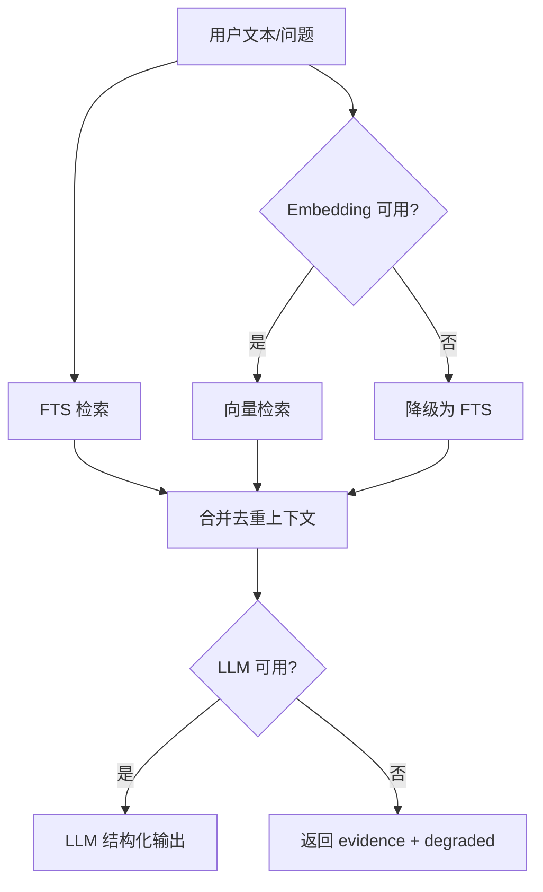

# AI 集成架构

AI 能力由 `AiService` 承担，是可选增强层，不影响离线基础功能。

## 能力边界

| 能力 | 是否依赖外部 API | 说明 |
| --- | --- | --- |
| 基础规则校验 | 否 | 本地读取角色红线、世界规则、伏笔状态。 |
| FTS 检索 | 否 | SQLite FTS5。 |
| 向量索引 | 是 | 需要用户配置 Embedding API。 |
| AI 增强校验 | 是 | 需要用户配置 LLM API，可结合 RAG evidence。 |
| 设定补全 | 是 | 生成结构化字段建议，需用户确认。 |
| RAG 问答 | 是 | 检索本地上下文后调用 LLM。 |

## Provider 支持

- OpenAI 兼容 Chat Completions。
- OpenAI 兼容 Embeddings。
- Anthropic Messages 风格接口。
- 自定义 Base URL、模型名、超时和 API Key。

## 数据与隐私

- API Key 在主进程加密后写入 SQLite `app_config`。
- 渲染端读取配置时只得到 `apiKeySet`。
- AI 调用只发送当前任务所需的文本片段、召回设定与输出 schema。
- 导出包不包含 API Key。

## RAG 流程

## 降级策略

- LLM 未配置：返回基础规则结果和检索证据。
- Embedding 未配置：使用 FTS 检索。
- 外部 API 超时/失败：返回 `degraded` 或 `error`，不阻断基础功能。
- LLM 输出无法解析：丢弃 AI 结果，保留本地结果。
