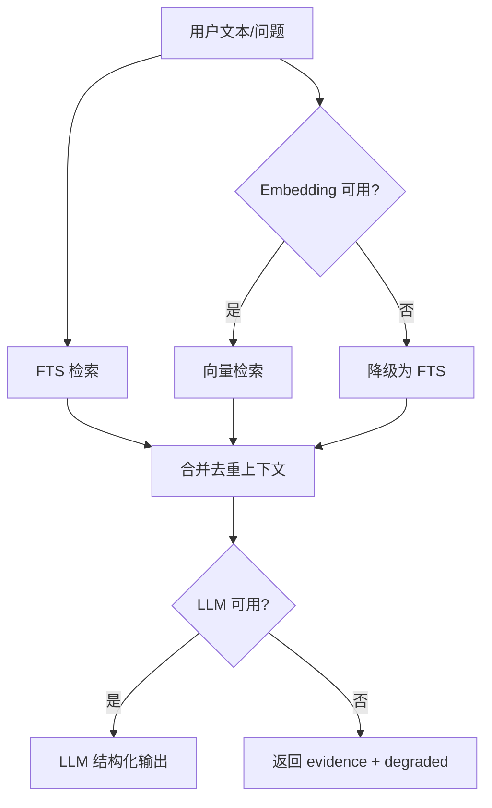
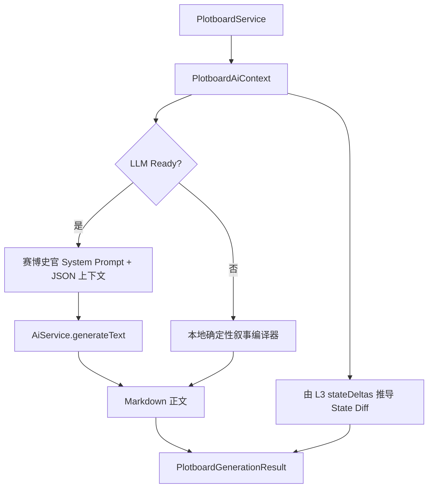

# AI 集成架构

AI 能力由 `AiService` 承担，是可选增强层，不影响离线基础功能。

## 能力边界

| 能力 | 是否依赖外部 API | 说明 |
| --- | --- | --- |
| 基础规则校验 | 否 | 本地读取角色红线、世界规则、伏笔状态。 |
| 剧情画布编辑/保存/导出 | 否 | 画布 JSON、状态快照、Markdown 大纲和 SVG 导出均可离线使用。 |
| 剧情画布本地降级生成 | 否 | LLM 未配置时按剧情卡事实和连线编译 Markdown 草稿。 |
| FTS 检索 | 否 | SQLite FTS5。 |
| 向量索引 | 是 | 需要用户配置 Embedding API。 |
| AI 增强校验 | 是 | 需要用户配置 LLM API，可结合 RAG evidence。 |
| 设定补全 | 是 | 生成结构化字段建议，需用户确认。 |
| RAG 问答 | 是 | 检索本地上下文后调用 LLM。 |
| 剧情画布 LLM 正文生成 | 是 | 需要 LLM；失败时降级为本地编译。 |

## Provider 支持

- OpenAI 兼容 Chat Completions。
- OpenAI 兼容 Embeddings。
- Anthropic Messages 风格接口。
- 自定义 Base URL、模型名、超时和 API Key。

## 数据与隐私

- API Key 只允许通过设置页输入，渲染端提交后立即交给主进程保存。
- 主进程将 API Key 加密后写入本机用户数据目录下的 SQLite `app_config` 表：LLM 使用 `ai.llm` 记录，Embedding 使用 `ai.embedding` 记录，密文字段名为 `encryptedApiKey`。
- 加密优先使用 Electron `safeStorage`；不可用时使用由本机用户、主机名和应用加密 scope 派生的 AES-GCM 密钥。
- 渲染端读取配置时只得到 `apiKeySet`，不会收到明文 API Key。
- 代码仓库、文档、测试和示例配置不得提交真实 API Key；测试只能使用 `TEST_*_PLACEHOLDER_DO_NOT_USE` 这类明显不可用的占位值。
- AI 调用只发送当前任务所需的文本片段、召回设定与输出 schema。
- 剧情画布生成上下文包含当前选中卡片、关联素材摘要/正文、状态快照和邻近摘要，不发送无关作品全文。
- 导出包、剧情画布 JSON、状态快照、Markdown 大纲和 SVG 图片不包含 API Key。

## API Key 管理规范

- 本地开发如需临时变量，只能放入 `.env` 或 `.env.local`，这些文件已在 `.gitignore` 中排除；可提交的示例文件只能使用空值或占位符。
- 不在源码、测试、文档、截图、日志、Issue、PR 描述中粘贴真实 API Key。
- 新增 Provider、测试或示例时，使用不可用占位符，例如 `TEST_API_KEY_PLACEHOLDER_DO_NOT_USE`，不要使用形似真实服务商 Key 的字符串。
- 提交前必须执行密钥扫描，至少检查 `apiKey`、`authorization`、`bearer`、`secret`、`token`、`sk-`、`AIza` 等模式。
- 一旦怀疑 Key 被提交或泄露，立即在服务商控制台吊销并重新签发，不依赖删除提交作为唯一补救。

## RAG 流程

## 剧情画布生成流程

## 降级策略

- LLM 未配置：返回基础规则结果和检索证据；剧情画布生成返回 `degraded` 和本地 Markdown。
- Embedding 未配置：使用 FTS 检索。
- 外部 API 超时/失败：返回 `degraded` 或 `error`，不阻断基础功能。
- LLM 输出无法解析：丢弃 AI 结果，保留本地结果或本地 findings。
- State Diff 只作为建议，必须由用户确认后写入状态快照。