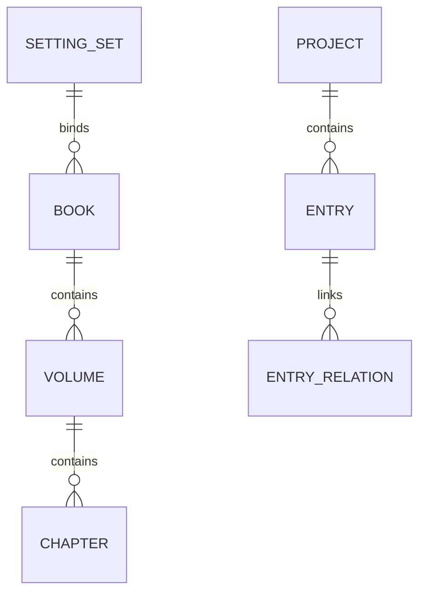

# 核心数据模型

数据模型以 `src/shared/storageTypes.ts` 为代码权威来源。

## 创作链路

## 主要实体

| 实体 | 说明 | 事实源 |
| --- | --- | --- |
| `SettingSetManifest` | 设定集，跨书目复用角色/世界观设定 | `setting-sets/<id>/setting-set.json` |
| `ProjectManifest` | 作品元数据 | `projects/<projectId>/project.json` |
| `BookManifest` | 书目元数据，可绑定设定集 | `books/<bookId>/book.json` |
| `VolumeNode` | 分卷元数据 | `books/<bookId>/volumes/<volumeId>.json` |
| `ChapterNode` | 章节正文和元数据 | `books/<bookId>/chapters/<chapterId>.md` + `.json` |
| `ProjectEntry` | 角色、世界观、伏笔条目 | `projects/<projectId>/{characters|worlds|plots}/<entryId>.json|md` |

## 条目类型

| 类型 | TypeScript | 关键字段 |
| --- | --- | --- |
| 角色 | `CharacterEntry` | `role`、`appearance`、`personalityTags`、`abilities`、`background`、`redLines` |
| 世界观 | `WorldEntry` | `category`、`rules` |
| 伏笔 | `PlotEntry` | `setupChapter`、`expectedPayoffChapter`、`status`、`relatedCharacters` |

## 章节状态

`ChapterStatus = not_started | drafting | revision | done | locked`

## 伏笔状态

`PlotStatus = open | resolved | abandoned`

## 存储原则

- JSON/Markdown 是事实源。
- SQLite 仅作为派生索引、检索和配置存储。
- 导入导出不包含 API Key。
- RAG embedding 保存在 `vector_chunks`，可从事实源重建。
