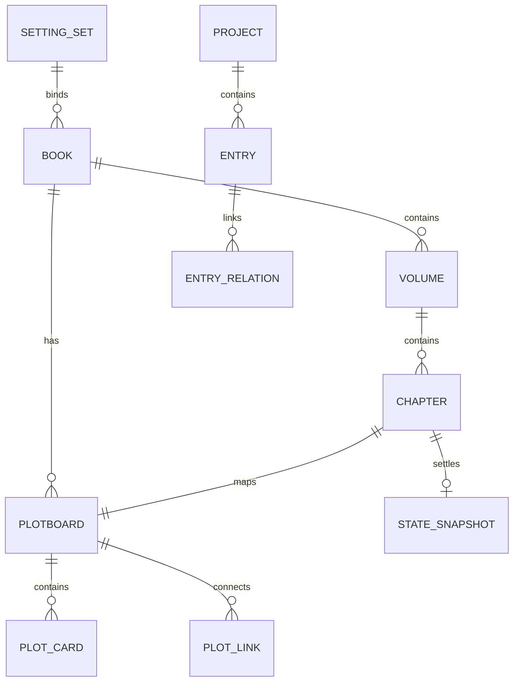

# 核心数据模型

数据模型以 `src/shared/storageTypes.ts` 为代码权威来源。

## 创作链路

## 主要实体

| 实体 | 说明 | 事实源 |
| --- | --- | --- |
| `SettingSetManifest` | 设定集，跨书目复用角色/世界观设定 | `setting-sets/<id>/setting-set.json` |
| `ProjectManifest` | 作品元数据 | `projects/<projectId>/project.json` |
| `BookManifest` | 书目元数据，可绑定设定集 | `books/<bookId>/book.json` |
| `VolumeNode` | 分卷元数据 | `books/<bookId>/volumes/<volumeId>.json` |
| `ChapterNode` | 章节正文和元数据 | `books/<bookId>/chapters/<chapterId>.md` + `.json` |
| `ProjectEntry` | 角色、世界观、伏笔条目 | `projects/<projectId>/{characters|worlds|plots}/<entryId>.json|md` |
| `Plotboard` | 章节剧情画布，包含剧情卡、连线、状态模板和视口 | `books/<bookId>/plotboards/<chapterId>.plotboard.json` |
| `StateSnapshot` | 章节 L2 状态快照 | `books/<bookId>/states/<chapterId>.state-snapshot.json` |

## 条目类型

| 类型 | TypeScript | 关键字段 |
| --- | --- | --- |
| 角色 | `CharacterEntry` | `role`、`appearance`、`personalityTags`、`abilities`、`background`、`redLines` |
| 世界观 | `WorldEntry` | `category`、`rules` |
| 伏笔 | `PlotEntry` | `setupChapter`、`expectedPayoffChapter`、`status`、`relatedCharacters` |

## 剧情画布模型

### `Plotboard`

| 字段 | 类型 | 说明 |
| --- | --- | --- |
| `schemaVersion` | `1` | 画布 schema 版本。 |
| `plotboardId` | `string` | 画布唯一 ID。 |
| `bookId` / `chapterId` | `string` | 绑定书目和章节；当前文件名为 `<chapterId>.plotboard.json`。 |
| `projectId` / `settingSetId` | `string?` | 素材读取和设定集关联。 |
| `cards` | `PlotCard[]` | 剧情卡列表。 |
| `links` | `PlotLink[]` | 卡片连线列表。 |
| `stateTemplates` | `StateTemplate[]?` | 自定义或内置状态字段模板。 |
| `viewport` | `{ x; y; zoom }` | 画布视口。 |
| `createdAt` / `updatedAt` | `string` | ISO 时间。 |

### `PlotCard`

关键字段：`cardId`、`title`、`fact`、`cardType`、`timecode?`、`povCharacterId?`、`locationWorldEntryId`、`characterIds`、`worldEntryIds`、`plotEntryIds`、`stateDeltas`、`narrativeTone`、`detailLevel?`、`generationInstruction?`、`x`、`y`、`createdAt`、`updatedAt`。

`cardType = event | dialogue | battle | clue_setup | clue_reinforce | clue_payoff | transition | narration`。

当前渲染端还会使用兼容扩展字段：`chapterIds`、`templateIds`、`plotClueUsages`；共享类型通过索引签名保留未知字段。

### `PlotLink`

关键字段：`linkId`、`sourceCardId`、`targetCardId`、`linkType`、`motivation?`、`condition?`。

`linkType = sequence | causal | parallel | flashback | conditional`。

## 状态模型

| 类型 | 说明 |
| --- | --- |
| `StateTemplate` | 状态字段模板，包含 owner、字段名、值类型、当前值、语义提示和可见性。 |
| `StateSnapshot` | 章节级 L2 快照，包含 `states` 和 `sourceDiffIds`。 |
| `StateDelta` | 剧情卡 L3 场景增量，支持 `set`、`increase`、`decrease`、`append`、`remove`。 |
| `StateDiff` | AI/本地生成后的状态变更建议，状态为 `suggested`、`accepted`、`modified`、`rejected`。 |

## 生成与校验模型

- `PlotboardGenerationRequest`：由 `bookId`、`chapterId` 和 `settings` 组成，支持单卡、选区、全章、续写、重写五种模式。
- `PlotboardAiContext`：包含选中剧情卡、连线、角色、世界规则、线索、状态模板、章节快照、插叙快照、场景增量、邻近摘要和生成设置。
- `PlotboardGenerationResult`：返回 `markdown`、`stateDiffs`、`context`、`warnings`、`usage?` 和 `status`。
- `PlotboardValidationResult`：返回按类别统计的 summary、findings 和 `clueStatusHints`。

## 章节状态

`ChapterStatus = not_started | drafting | revision | done | locked`

剧情画布写入生成正文后，章节状态更新为 `drafting`。

## 伏笔状态

`PlotStatus = open | resolved | abandoned`

画布校验会根据 `clue_payoff` / `plotClueUsages.payoff` 提示是否将对应 `PlotEntry.status` 更新为 `resolved`，但不会自动修改事实源。

## 存储原则

- JSON/Markdown 是事实源。
- SQLite 仅作为派生索引、检索和配置存储。
- 导入导出不包含 API Key。
- RAG embedding 保存在 `vector_chunks`，可从事实源重建。
- 剧情画布、剧情卡、连线、状态快照允许保留未知字段以支持后续 schemaVersion 升级。