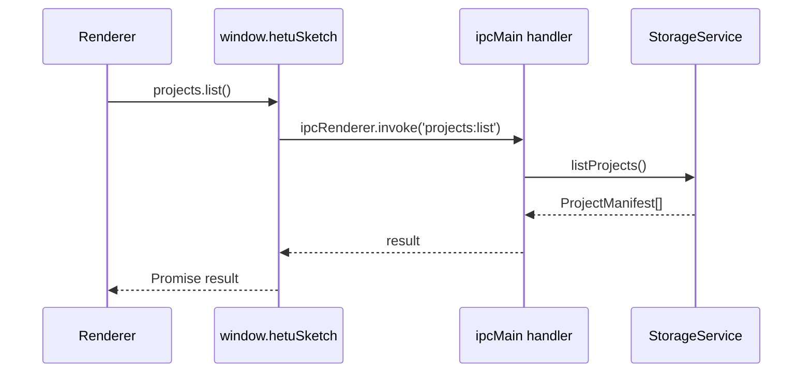

# IPC 通信契约

IPC 契约以 `src/shared/ipc.ts` 的 `IPC_CHANNELS` 与 `HetuSketchApi` 为代码权威来源。

## 调用边界



## 命名空间

| 命名空间 | 职责 |
| --- | --- |
| `app` | 应用信息与 ping。 |
| `search` | 搜索建议、全局搜索、最近访问。 |
| `dashboard` | Dashboard 统计。 |
| `settingSets` | 设定集 CRUD。 |
| `books` | 书目 CRUD 与设定集绑定。 |
| `chapters` | 分卷/章节树管理。 |
| `projects` | 作品 CRUD 与导入导出。 |
| `entries` | 角色、世界观、伏笔条目 CRUD。 |
| `validation` | 基础校验与 AI 增强校验。 |
| `ai` | AI 配置、提示词、技能、HTTP 工具、补全、伏笔、模型列表、流式能力。 |
| `agent` | 用户/系统智能体配置管理。 |
| `rag` | 向量索引构建、状态、查询与问答。 |
| `index` | 索引重建。 |
| `system` | 系统字体枚举。 |
| `desktop` | 悬浮窗、置顶、窗口控制、新窗口。 |

## 安全规则

- 渲染端不直接访问文件系统、SQLite、Electron 主进程对象或明文 API Key。
- Preload 只暴露 `window.hetuSketch` 白名单对象。
- 主进程对字符串长度、枚举值、limit、文本长度、URL 协议做基础归一化。
- 导入导出路径选择只在主进程 dialog 中执行。
- AI 配置读取不返回明文 `apiKey`，只返回 `apiKeySet`。

## 流式 IPC

`ai.streamValidation`、`ai.streamRagAnswer`、`ai.streamCompleteSetting`、`ai.streamForeshadowing` 使用 requestId 生成临时事件通道：

```text
<base-channel>:chunk:<requestId>
<base-channel>:end:<requestId>
<base-channel>:error:<requestId>
```

渲染端在 Promise 结束或失败后移除监听器。
