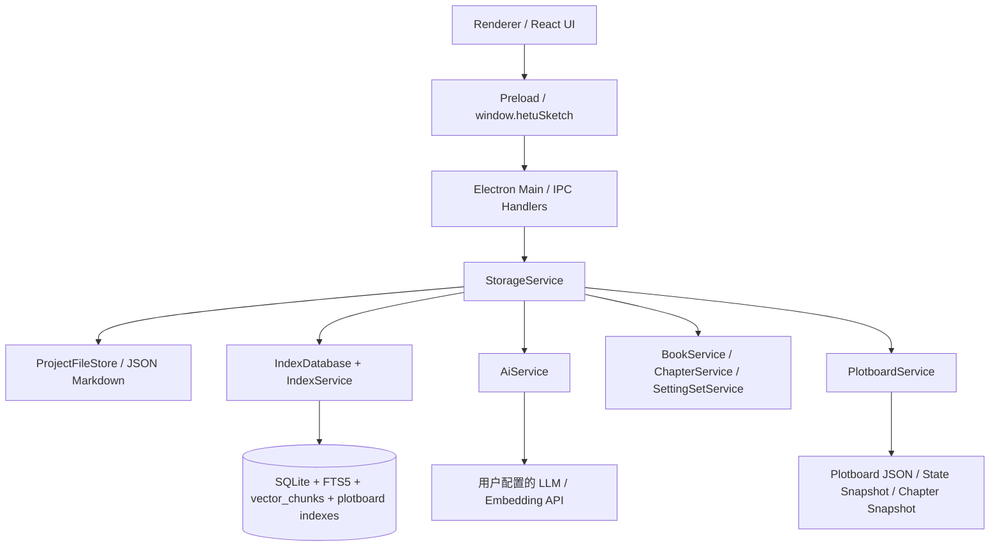

# 系统总览

HetuSketch 是 Electron 桌面应用，采用 **主进程服务层 + Preload 安全桥 + React 渲染端** 的三层架构。

## 架构原则

- 本地优先：用户作品、设定、剧情画布、章节、索引和配置均存储在本机。
- 文件为事实源：JSON / Markdown 保存真实内容，SQLite 可重建。
- 渲染端无 Node 权限：渲染端只能通过 `window.hetuSketch` 调用白名单 API。
- AI 可选启用：未配置外部 API 时基础功能和剧情画布降级生成仍可使用。
- 类型共享：`src/shared` 定义 IPC 与数据模型，供 main / preload / renderer 共用。

## 运行时分层

## 核心代码位置

| 区域 | 代码 |
| --- | --- |
| 主进程入口 | `src/main/index.ts` |
| Preload API | `src/preload/index.ts` |
| IPC 契约 | `src/shared/ipc.ts` |
| 共享数据模型 | `src/shared/storageTypes.ts` |
| 主服务门面 | `src/main/services/storageService.ts` |
| 文件事实源 | `src/main/services/projectFileStore.ts` |
| SQLite 索引 | `src/main/services/indexDatabase.ts` |
| 索引同步 | `src/main/services/indexService.ts` |
| AI/RAG 服务 | `src/main/services/aiService.ts` |
| 剧情画布服务 | `src/main/services/plotboardService.ts` |
| 剧情画布 IPC | `src/main/ipc/plotboards.ts` |
| React 工作台 | `src/renderer/src/App.tsx` |
| 剧情画布页面 | `src/renderer/src/pages/PlotboardPage.tsx` |
| Zustand Store | `src/renderer/src/store/appStore.ts` |

## 关键流程

1. Electron 启动后注册 IPC、托盘、快捷键并创建主窗口与悬浮速查窗。
2. 渲染端加载 React 工作台，通过 preload 暴露的 `window.hetuSketch` 调用主进程。
3. 主进程通过 `StorageService` 调度文件、SQLite、AI、字体、书目章节和剧情画布等服务。
4. 写入业务数据时先写 JSON/Markdown 文件，再同步 SQLite 派生索引。
5. 搜索、Dashboard、列表主要读取 SQLite；详情读取事实文件。
6. 剧情画布从章节进入，以 `PlotboardService` 读写画布、状态快照、正文快照，并按需调用 AI 和校验逻辑。