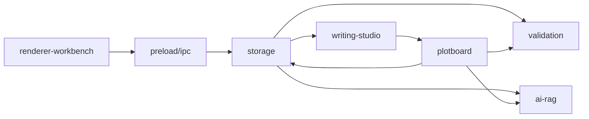

# 模块总览

HetuSketch 按运行层和业务域划分模块。

## 模块清单

| 模块 | 文档 | 代码 |
| --- | --- | --- |
| 渲染端工作台 | `renderer-workbench/README.md` | `src/renderer/src/App.tsx`, `src/renderer/src/pages/*` |
| 本地存储与索引 | `storage/README.md` | `src/main/services/*Service.ts`, `indexDatabase.ts`, `projectFileStore.ts` |
| AI 与 RAG | `ai-rag/README.md` | `src/main/services/aiService.ts`, `src/shared/aiCore/*` |
| 写作工作台 | `writing-studio/README.md` | `src/renderer/src/pages/WritingStudioPage.tsx`, `chapterService.ts` |
| 剧情画布 | `plotboard/README.md` | `src/renderer/src/pages/PlotboardPage.tsx`, `src/main/services/plotboardService.ts`, `src/main/ipc/plotboards.ts` |
| 逻辑校验 | `validation/README.md` | `storageService.ts`, `plotboardService.ts`, `ChecksPage.tsx` |

## 模块协作原则

- 渲染端只调用 `window.hetuSketch`，不直接访问主进程服务。
- 主进程通过 `StorageService` 聚合业务能力。
- 文件事实源写入后同步 SQLite 索引。
- AI/RAG 调用必须可降级，不阻断离线功能。
- 剧情画布只保存设定/章节素材引用 ID，不复制角色、世界观或线索事实源。