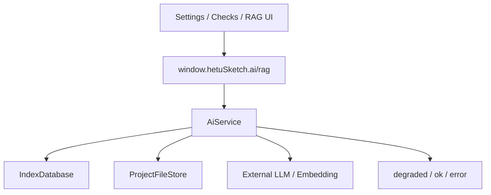

# ai-rag 模块

## 职责

负责 LLM / Embedding 配置、API Key 加密、连接测试、提示词、技能、HTTP 工具、向量索引、RAG 查询、AI 增强校验、设定补全、伏笔提醒和流式输出。

## 依赖

- **上游模块**：`StorageService`、IPC `ai.*` / `rag.*`。
- **下游模块**：`IndexDatabase`、`ProjectFileStore`、用户配置的外部 AI API。

## 核心文件

| 文件 | 职责 |
| --- | --- |
| `src/main/services/aiService.ts` | AI/RAG 主服务。 |
| `src/main/services/indexDatabase.ts` | AI 配置、HTTP 工具、vector_chunks 与 vector_index_state 存储。 |
| `src/shared/aiCore/provider/*` | Provider 配置与类型。 |
| `src/main/services/aiCore/providerAdapter.ts` | Provider 适配。 |
| `src/shared/storageTypes.ts` | AI/RAG 请求响应类型。 |

## 数据流

## 对外接口

- `ai.getConfig/saveConfig/testConnection`
- `ai.getPrompts/savePrompts`
- `ai.listSkills/saveSkills`
- `ai.listHttpTools/saveHttpTool/deleteHttpTool`
- `ai.completeSetting/foreshadowing/listModels`
- `ai.streamValidation/streamRagAnswer/streamCompleteSetting/streamForeshadowing`
- `rag.build/state/query/answer`

## 已知问题

- 向量检索当前基于 SQLite JSON embedding + JS 余弦相似度，数据量增大后需要 ANN 优化。
- API Key 尚未接入系统凭据管理器。
