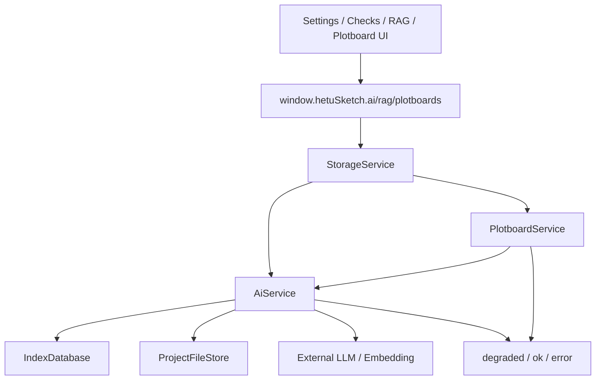

# ai-rag 模块

## 职责

负责 LLM / Embedding 配置、API Key 加密、连接测试、提示词、技能、HTTP 工具、向量索引、RAG 查询、AI 增强校验、设定补全、伏笔提醒、剧情画布正文生成支持和流式输出。

## 依赖

- **上游模块**：`StorageService`、IPC `ai.*` / `rag.*`、`plotboards.generate`。
- **下游模块**：`IndexDatabase`、`ProjectFileStore`、用户配置的外部 AI API。

## 核心文件

| 文件 | 职责 |
| --- | --- |
| `src/main/services/aiService.ts` | AI/RAG 主服务和 LLM 调用。 |
| `src/main/services/plotboardService.ts` | 剧情画布 AI 上下文编译、赛博史官提示词和降级生成。 |
| `src/main/services/indexDatabase.ts` | AI 配置、HTTP 工具、vector_chunks 与 vector_index_state 存储。 |
| `src/shared/aiCore/provider/*` | Provider 配置与类型。 |
| `src/main/services/aiCore/providerAdapter.ts` | Provider 适配。 |
| `src/shared/storageTypes.ts` | AI/RAG 与剧情画布生成请求响应类型。 |

## 数据流

## 对外接口

- `ai.getConfig/saveConfig/testConnection`
- `ai.getPrompts/savePrompts`
- `ai.listSkills/saveSkills`
- `ai.listHttpTools/saveHttpTool/deleteHttpTool`
- `ai.completeSetting/foreshadowing/listModels`
- `ai.streamValidation/streamRagAnswer/streamCompleteSetting/streamForeshadowing`
- `rag.build/state/query/answer`
- `plotboards.generate/streamGenerate/buildAiContext`

## 剧情画布 AI 约束

- 系统提示词要求 AI 作为“赛博史官”，只依据剧情卡事实、设定、状态快照和用户指令生成小说 Markdown。
- 生成上下文包含：选中剧情卡、连线、角色红线、世界规则、线索状态、状态模板、章节快照、插叙快照、L3 场景增量、邻近卡片摘要和生成设置。
- LLM 不可用或调用失败时，`PlotboardService` 使用本地确定性叙事编译器，返回 `status: degraded` 与 warning。
- AI 不直接写入状态快照；State Diff 必须由用户确认后经 `plotboards.settleDiffs` 写入。
- API Key 不写入画布 JSON、状态快照、Markdown 大纲或 SVG 导出文件。

## 已知问题

- 向量检索当前基于 SQLite JSON embedding + JS 余弦相似度，数据量增大后需要 ANN 优化。
- API Key 尚未接入系统凭据管理器。
- 剧情画布生成当前只解析正文 Markdown；State Diff 由本地 L3 增量推导。