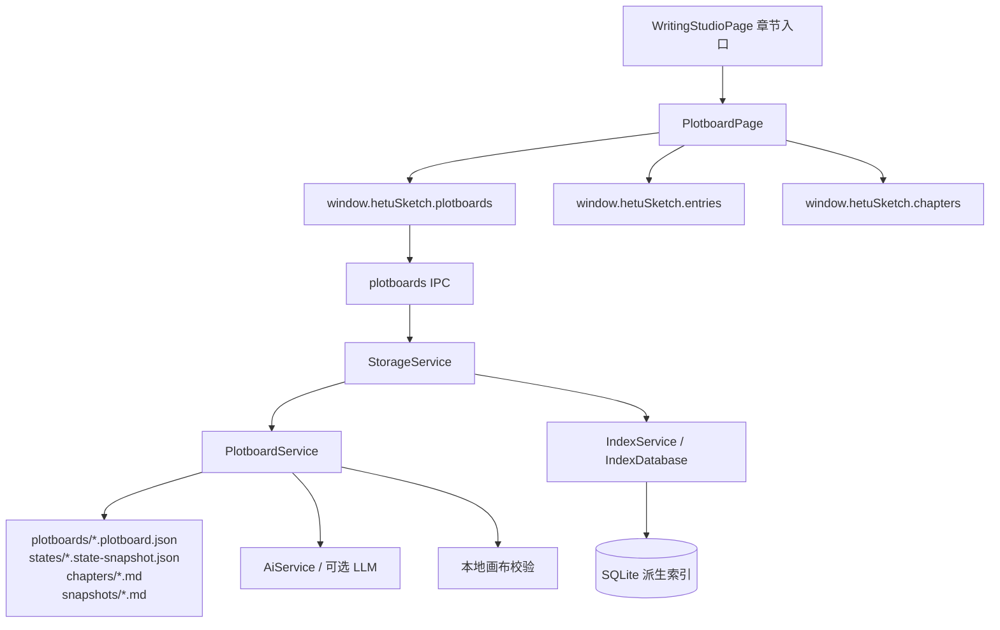

# plotboard 模块

## 职责

负责章节级剧情画布编排，是设定管理中心与写作工作台正文编辑器之间的结构化剧情层。用户在画布中创建剧情卡、连接事件关系、绑定角色/世界观/线索/章节/模板素材、维护 L3 场景状态增量，并将结构化剧情交给 AI 叙事生成链路产出章节 Markdown 草稿。

## 依赖

- **上游模块**：`writing-studio`（章节入口与返回章节）、渲染端工作台路由、当前作品状态。
- **下游模块**：`storage`（本地 JSON / Markdown 事实源、SQLite 派生索引）、`ai-rag`（LLM 生成与降级）、`validation`（时间线、状态、规则、伏笔、章节衔接校验）、设定条目与章节服务（素材库读取）。

## 核心文件

| 文件 | 职责 |
| --- | --- |
| `src/renderer/src/pages/PlotboardPage.tsx` | 剧情画布页面；包含顶部工具栏、素材库、DOM 卡片画布、SVG 连线、属性面板、生成面板、校验面板、多 POV 状态轴和底部状态栏。 |
| `src/main/services/plotboardService.ts` | 画布 JSON、状态快照、正文快照、AI 上下文编译、降级生成、State Diff 结算、逻辑校验和 Markdown 大纲导出。 |
| `src/main/services/storageService.ts` | 主进程业务门面；包装 plotboard 服务并触发索引扫描。 |
| `src/main/services/indexDatabase.ts` | 剧情卡、时间线、章节快照和线索使用派生索引表。 |
| `src/main/services/indexService.ts` | 扫描 `books/<bookId>/plotboards` 与 `books/<bookId>/states`，从事实源重建索引。 |
| `src/main/ipc/plotboards.ts` | 剧情画布 IPC handler 注册。 |
| `src/preload/index.ts` | `window.hetuSketch.plotboards` 安全桥与流式生成监听封装。 |
| `src/shared/storageTypes.ts` | `Plotboard`、`PlotCard`、`PlotLink`、`StateTemplate`、`StateSnapshot`、`StateDiff`、`PlotboardValidationResult` 等共享类型。 |
| `src/shared/ipc.ts` | 剧情画布 IPC 通道常量和 preload API 类型。 |
| `src/main/services/plotboardService.test.ts` | AI 上下文、降级生成、Diff 结算、导出、校验规则测试。 |
| `src/main/services/storageService.test.ts` | 画布创建、保存、未知字段保留、快照、正文写入、索引同步集成测试。 |

## 数据流

## 对外接口

渲染端只通过 `window.hetuSketch.plotboards` 调用：

- `create({ bookId, chapterId, projectId?, settingSetId? })`
- `open(bookId, chapterId)`
- `save(plotboard)`
- `saveSnapshot(bookId, snapshot)` / `loadSnapshot(bookId, chapterId)`
- `syncIndex(bookId)`
- `exportOutline(bookId, chapterId)`
- `saveChapterSnapshot(bookId, chapterId)`
- `writeGeneratedMarkdown(input)`
- `buildAiContext(request)`
- `generate(request)` / `streamGenerate(request, onChunk)`
- `settleDiffs(input)`
- `validate(input)`

详细契约见 [api.md](./api.md) 与 `../../50-api/ipc-api.md`。

## 已知限制

- 画布渲染使用 React DOM 卡片 + SVG 连线，首版未引入 React Flow；超大规模自动布局和复杂路由连线仍需后续评估。
- 图片导出当前为渲染端生成 SVG 文件；不是像素级 PNG 截图。
- `streamGenerate` 的“取消”目前在 UI 层忽略后续结果，主进程生成任务不提供独立取消 IPC。
- 状态模板可随画布保存；章节快照文件只在保存快照、结算 Diff 或生成上下文缺省创建时参与。
- AI 未配置时使用本地确定性叙事编译器降级生成，返回 `degraded` 和 warning。
- 素材库通过现有 entries/chapters API 读取摘要；画布文件只保存引用 ID，不复制素材事实。