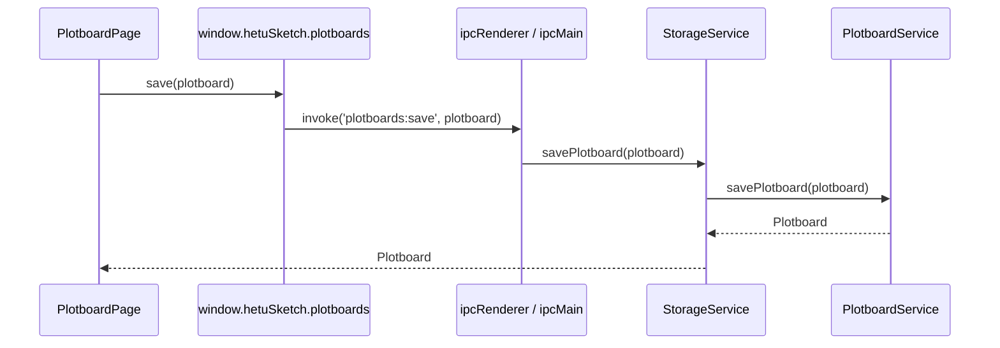

# plotboard API

## 调用边界

剧情画布 API 通过 preload 暴露在 `window.hetuSketch.plotboards` 命名空间下。渲染端不直接访问文件系统、SQLite、Electron 主进程对象或明文 API Key。



## preload 方法清单

| 方法 | IPC 通道 | 参数 | 返回 | 说明 |
| --- | --- | --- | --- | --- |
| `create(input)` | `plotboards:create` | `{ bookId, chapterId, projectId?, settingSetId? }` | `Promise<Plotboard>` | 指定章节创建画布；已存在则返回已有画布。 |
| `open(bookId, chapterId)` | `plotboards:open` | `bookId`, `chapterId` | `Promise<Plotboard>` | 读取 `books/<bookId>/plotboards/<chapterId>.plotboard.json`。 |
| `save(plotboard)` | `plotboards:save` | `Plotboard` | `Promise<Plotboard>` | 保存画布 JSON，补齐默认状态模板并更新时间；`StorageService` 随后扫描书目索引。 |
| `saveSnapshot(bookId, snapshot)` | `plotboards:snapshot:save` | `bookId`, `StateSnapshot` | `Promise<StateSnapshot>` | 写入章节状态快照。 |
| `loadSnapshot(bookId, chapterId)` | `plotboards:snapshot:load` | `bookId`, `chapterId` | `Promise<StateSnapshot>` | 读取章节状态快照；不存在时 Promise reject。 |
| `syncIndex(bookId)` | `plotboards:index:sync` | `bookId` | `Promise<IndexSyncSummary>` | 从书目事实源重建剧情画布和状态快照索引。 |
| `exportOutline(bookId, chapterId)` | `plotboards:outline:export` | `bookId`, `chapterId` | `Promise<string>` | 返回 Markdown 大纲文本，渲染端负责下载。 |
| `saveChapterSnapshot(bookId, chapterId)` | `plotboards:chapter-snapshot:save` | `bookId`, `chapterId` | `Promise<ChapterBodySnapshotResult>` | 将当前章节正文保存为版本快照。 |
| `writeGeneratedMarkdown(input)` | `plotboards:generated-markdown:write` | `GeneratedMarkdownWriteInput` | `Promise<GeneratedMarkdownWriteResult>` | 写入章节 Markdown；默认先保留正文快照，并将章节状态置为 `drafting`。 |
| `buildAiContext(request)` | `plotboards:ai-context:build` | `PlotboardGenerationRequest` | `Promise<PlotboardAiContext>` | 编译剧情卡、连线、素材详情、状态快照、场景增量和邻近摘要。 |
| `generate(request)` | `plotboards:generate` | `PlotboardGenerationRequest` | `Promise<PlotboardGenerationResult>` | 生成 Markdown 和 State Diff；LLM 不可用时降级为本地编译。 |
| `streamGenerate(request, onChunk)` | `plotboards:generate:stream` | `PlotboardGenerationRequest`, chunk 回调 | `Promise<PlotboardGenerationResult>` | 通过临时 `chunk/end/error` 通道返回进度和最终结果。 |
| `settleDiffs(input)` | `plotboards:diffs:settle` | `StateDiffSettlementInput` | `Promise<StateDiffSettlementResult>` | 仅将 `accepted` / `modified` Diff 写入章节快照。 |
| `validate(input)` | `plotboards:validate` | `PlotboardValidationRequest` | `Promise<PlotboardValidationResult>` | 校验时间线、角色状态、红线、世界规则、伏笔顺序和章节衔接。 |

## 核心请求响应

```ts
type PlotboardGenerationRequest = {
  bookId: string;
  chapterId: string;
  settings: {
    mode: 'single_card' | 'selection' | 'full_chapter' | 'continue' | 'rewrite';
    selectedCardIds?: string[];
    userInstruction?: string;
    targetWords?: number;
    appendToExisting?: boolean;
    rewriteStrategy?: 'replace_all' | 'append' | 'mark_stale_and_append';
  };
}

type PlotboardGenerationResult = {
  requestId: string;
  status: 'ok' | 'degraded' | 'error';
  markdown: string;
  stateDiffs: StateDiff[];
  context: PlotboardAiContext;
  warnings: string[];
  usage?: AiAgentResponse<unknown>['usage'];
  error?: string;
}

type PlotboardValidationRequest = {
  bookId: string;
  chapterId: string;
  markdown?: string;
}
```

## 流式通道约定

基础通道为 `plotboards:generate:stream`。preload 为每次调用生成 `requestId`，主进程向以下临时通道发送事件：

```text
plotboards:generate:stream:chunk:<requestId>
plotboards:generate:stream:end:<requestId>
plotboards:generate:stream:error:<requestId>
```

chunk 类型复用 `AiStreamChunk = { type: 'delta' | 'finish' | 'usage' | 'error'; content?; usage?; error? }`。渲染端完成、失败或拒绝后必须移除监听器。

## 安全与校验规则

- 渲染端传入的 `bookId`、`chapterId` 只作为 ID 使用；文件路径由主进程根据 `StoragePaths` 计算。
- IPC handler 使用 `asRequiredString` / `asObject` 做基础类型约束，业务归属由服务层文件结构和章节服务约束。
- 画布、快照、导出文件不得写入 API Key；AI 配置只在主进程读取。
- 未知字段在 `Plotboard`、`PlotCard`、`PlotLink`、`StateSnapshot` 中通过索引签名保留，支持后续 schemaVersion 升级。
- AI State Diff 必须经 `settleDiffs` 且状态为 `accepted` 或 `modified` 才写入快照。