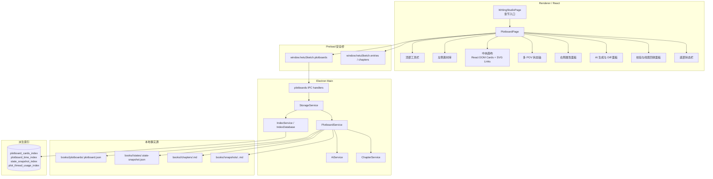

# plotboard 架构设计

## 模块定位

剧情画布位于角色/世界观/线索设定库与章节 Markdown 正文之间，负责把“设定事实”组织成“章节事件链”。画布不直接改变角色、世界观或线索事实源；它保存引用 ID、剧情卡事实、连线关系、状态增量、视口和状态模板。

## 架构原则

- **本地优先**：剧情画布、状态快照、章节正文和正文快照均写入本地文件。
- **文件为事实源**：`*.plotboard.json`、`*.state-snapshot.json`、章节 Markdown 是权威数据；SQLite 仅为派生索引。
- **渲染端无 Node 权限**：`PlotboardPage` 只能通过 `window.hetuSketch` 调用白名单 API。
- **AI 可选增强**：未配置 LLM 时降级为本地确定性叙事编译，画布编辑、保存、导出和本地校验仍可用。
- **AI 不直接改事实**：AI/本地生成只产出 Markdown 和 State Diff 建议；状态快照变更必须经用户确认。

## 系统架构图



## 前端技术方案

| 领域 | 当前实现 | 说明 |
| --- | --- | --- |
| 通用 UI | Ant Design + `@ant-design/icons` | 工具栏、表单、Tabs、Modal、Progress、Tag、Empty、message。 |
| 画布状态 | `PlotboardPage.tsx` 内 React state | 当前画布副本、选中态、撤销/重做栈、拖拽/平移/框选、生成和校验状态均为页面会话态。 |
| 节点渲染 | React DOM | `PlotCardNode` 展示类型、timecode、事实摘要、绑定素材和校验标记。 |
| 连线渲染 | SVG | `PlotLink` 使用贝塞尔 path、箭头 marker 和关系标签。 |
| 缩放平移 | CSS transform + wheel | `viewport = { x, y, zoom }` 保存到画布 JSON。 |
| 事件处理 | 鼠标事件 + HTML Drag and Drop + 键盘事件 | 支持双击创建、拖拽卡片、拖拽素材、拖拽空白处平移、Shift 框选、Ctrl+S、Ctrl+Z/Y、Delete。 |
| 模板 | 渲染端内置模板常量 | 三幕式、推理揭示链、群像交叉线插入为普通卡片和连线。 |
| 导出 | Markdown 由主进程生成；SVG 图片由渲染端生成 | 图片导出文件扩展名为 `.svg`。 |

## 主进程服务方案

`StorageService` 是 IPC 后的统一门面；剧情画布相关方法委托 `PlotboardService`，保存/创建/快照保存后通过 `IndexService.scanBook(bookId)` 同步派生索引。

`PlotboardService` 负责：

1. 创建或读取章节绑定画布。
2. 保存画布并合并内置状态模板。
3. 保存/读取章节状态快照。
4. 生成章节正文前保存正文版本快照。
5. 编译 AI 上下文：剧情卡、连线、角色、世界规则、线索、状态模板、章节快照、插叙快照、场景增量和邻近摘要。
6. 调用 LLM 或降级为本地确定性叙事编译器。
7. 根据 L3 `stateDeltas` 生成 State Diff 建议。
8. 将确认/修改后的 Diff 写入 L2 状态快照。
9. 执行画布校验并提供卡片与 Markdown 段落定位。
10. 导出 Markdown 大纲。

## 存储方案

```text
books/<bookId>/
  chapters/
    <chapterId>.md
    <chapterId>.json
  plotboards/
    <chapterId>.plotboard.json
  states/
    <chapterId>.state-snapshot.json
  snapshots/
    <chapterId>.<snapshotId>.md
```

## SQLite 索引方案

| 索引表 | 作用 | 事实源 |
| --- | --- | --- |
| `plotboard_cards_index` | 按书目、章节、卡片类型、绑定角色/世界观/线索检索剧情卡 | `*.plotboard.json` |
| `plotboard_time_index` | 按 timecode、POV、地点和角色辅助时间线校验 | `*.plotboard.json` |
| `state_snapshot_index` | 按章节、对象和字段定位状态快照项 | `*.state-snapshot.json` |
| `plot_thread_usage_index` | 追踪线索在哪些卡片中被埋设、强化或回收 | `*.plotboard.json` |

索引写入失败不得破坏文件事实源；用户可通过 `plotboards.syncIndex(bookId)` 或全局索引重建恢复派生数据。

## AI 与校验边界

- AI 提示词要求“赛博史官”只依据剧情卡和设定生成 Markdown，不发明重大转折。
- LLM 不可用时 `generate` 返回 `status: 'degraded'`，正文由本地编译器按卡片顺序生成。
- State Diff 由 L3 场景增量推导，默认 `status: 'suggested'`，用户可改为 `accepted`、`modified` 或 `rejected`。
- 校验覆盖时间线、角色状态、行为红线、世界规则、伏笔顺序、章节衔接；若提供 Markdown，会尝试按标题/事实/sourceCardId 建立段落定位。