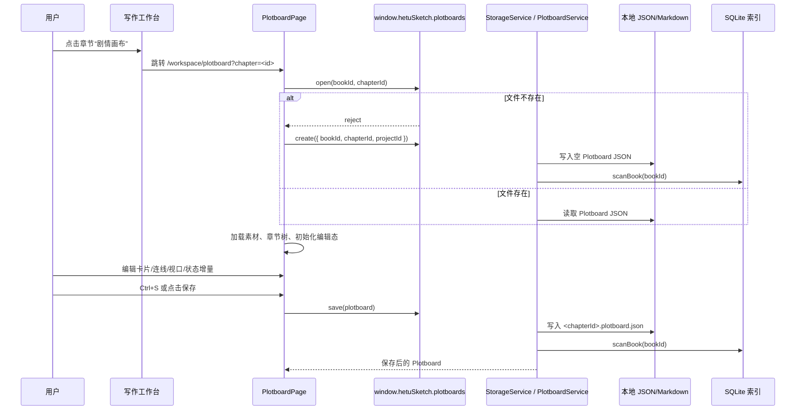
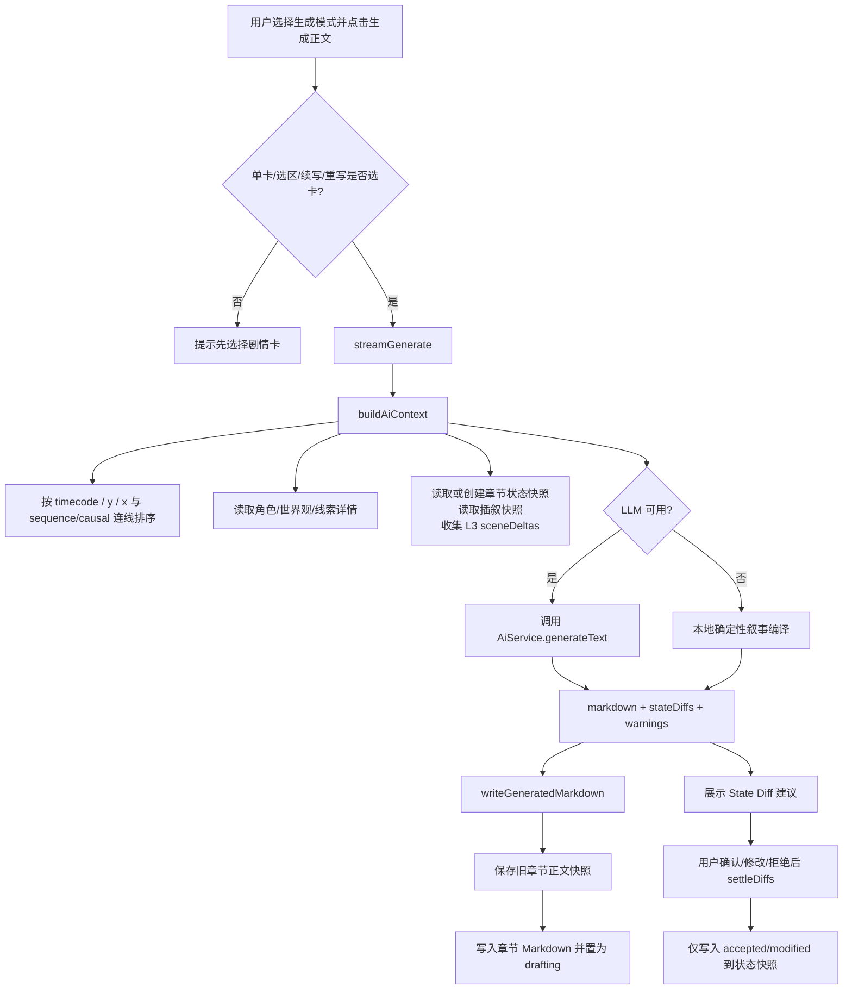
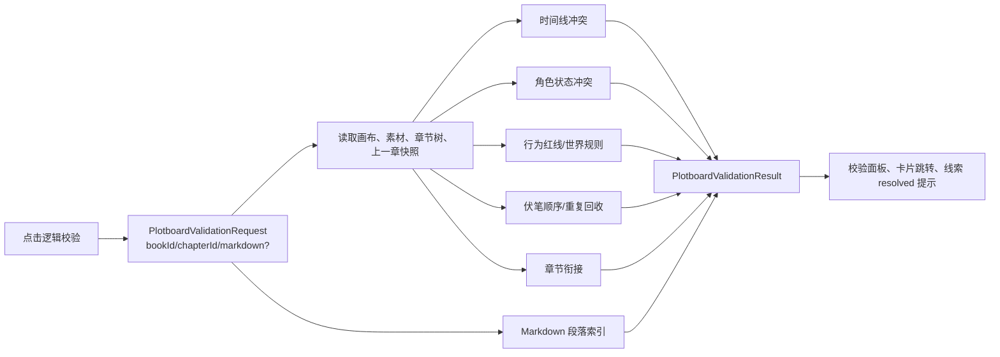

# plotboard 数据流程

## 数据来源

| 数据 | 来源 | 用途 |
| --- | --- | --- |
| 当前作品与章节 | `useAppStore.selectedProject`、路由 `?chapter=<chapterId>`、`chapters.listTree` | 打开/创建章节绑定画布，返回章节。 |
| 角色素材 | `entries.list({ type: 'character' })` / `entries.get` | 出场角色绑定、POV、AI 行为约束、红线校验。 |
| 世界观素材 | `entries.list({ type: 'world' })` / `entries.get` | 地点、规则、势力/能力体系绑定和世界规则校验。 |
| 线索素材 | `entries.list({ type: 'plot' })` | 伏笔埋设、强化、回收追踪和 resolved 更新提示。 |
| 章节素材 | `chapters.listTree(bookId)` | 跨章节引用、插叙快照辅助、素材绑定。 |
| 模板素材 | `PlotboardPage.tsx` 内置常量 | 三幕式、推理揭示链、群像交叉线快速插入。 |
| 剧情画布 | `books/<bookId>/plotboards/<chapterId>.plotboard.json` | 卡片、连线、状态模板、视口事实源。 |
| 状态快照 | `books/<bookId>/states/<chapterId>.state-snapshot.json` | L2 章节状态读取和结算写入。 |
| 章节正文 | `books/<bookId>/chapters/<chapterId>.md` | AI 生成写入、重写过期标记、正文校验定位。 |

## 打开与保存流程

## 素材绑定流程

1. 左侧素材库通过 `entries.list`、`chapters.listTree` 和内置模板加载素材摘要。
2. 用户点击素材：若已选中单卡，则绑定到该卡；否则在默认位置创建带素材引用的新卡。
3. 用户拖拽素材到空白画布：创建带该素材引用的剧情卡。
4. 用户拖拽素材到已有卡片：只追加引用 ID，不复制素材内容。
5. 世界观地理条目或卡片未设地点时，会询问是否同时设为 `locationWorldEntryId`。
6. 线索绑定时要求选择 `setup`、`reinforce` 或 `payoff`，写入 `plotClueUsages` 并调整卡片类型。

## AI 生成与正文写入流程

## 校验流程

## 索引同步时机

| 时机 | 同步内容 |
| --- | --- |
| `plotboards.create` | 创建空画布文件后扫描书目。 |
| `plotboards.save` | 保存剧情卡、连线、视口和状态模板后扫描书目。 |
| `plotboards.saveSnapshot` / `settleDiffs` | 状态快照写入后扫描书目。 |
| `plotboards.syncIndex(bookId)` | 从该书目下所有画布和状态快照文件重建派生索引。 |
| 全局 `index.rebuild(projectId?)` | 同步项目/书目/条目/画布/状态快照等可重建索引。 |

## 失败与降级

- 打开画布失败且文件不存在：渲染端自动调用 `create`。
- 保存画布失败：保留页面内存草稿，提示用户重试。
- 索引同步失败：文件事实源仍可保留；通过 `syncIndex` 或全局重建恢复。
- LLM 未配置或调用失败：生成链路返回 `degraded`，使用本地编译正文，并保留 warning。
- AI/本地生成的 State Diff 不会自动写入快照；用户必须逐条确认、修改或拒绝。
- UI 取消生成：停止展示后续结果，不写入章节；当前主进程生成任务不提供强制中止。