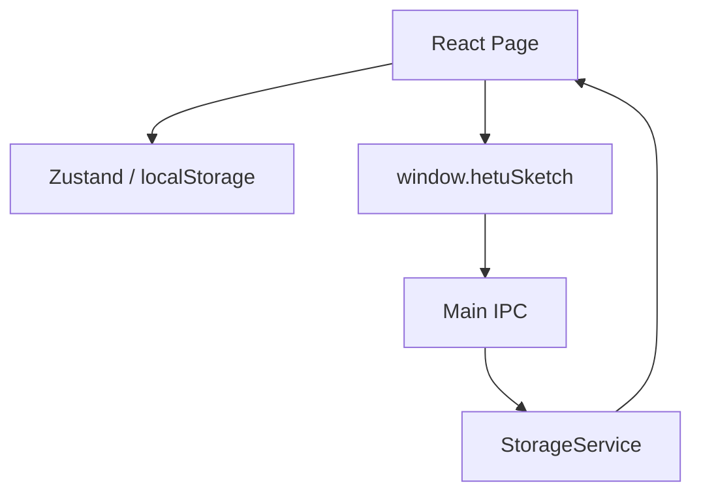

# renderer-workbench 模块

## 职责

负责主窗口与悬浮速查窗口中的 React UI、工作台布局、页面路由、主题字体和交互状态。

## 依赖

- **上游模块**：Preload `window.hetuSketch` API。
- **下游模块**：无直接下游；通过 IPC 间接调用主进程服务。

## 核心文件

| 文件 | 职责 |
| --- | --- |
| `src/renderer/src/App.tsx` | 工作台外壳、路由、Tab、Sash、活动栏、布局持久化。 |
| `src/renderer/src/store/appStore.ts` | Zustand UI 状态、AI 能力状态、字体状态。 |
| `src/renderer/src/pages/EntriesPage.tsx` | 角色、世界观、伏笔复用管理页。 |
| `src/renderer/src/pages/ProjectsPage.tsx` | 作品管理。 |
| `src/renderer/src/pages/SettingsPage.tsx` | 设置页。 |
| `src/renderer/src/pages/QuickLookupPage.tsx` | 悬浮速查窗口页面。 |
| `src/renderer/src/styles.css` | 全局样式与工作台布局样式。 |

## 数据流

## 对外接口

- 对主进程：只通过 `window.hetuSketch`。
- 对用户：工作台 UI、快捷键、拖拽、表单、搜索和悬浮窗。

## 已知问题

- 部分工作台状态和迭代状态仍在 localStorage，后续应迁移到主进程事实源。
- 工作台外壳与旧版页面通用样式并存，需要逐步收敛。
