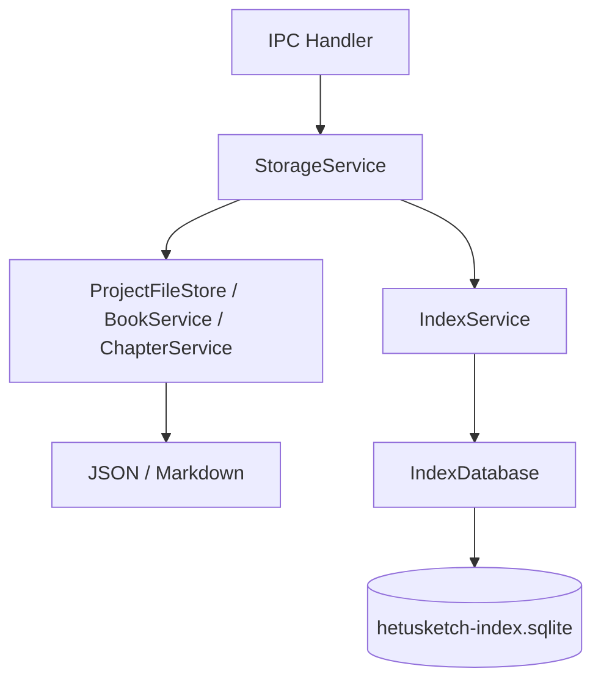

# storage 模块

## 职责

负责本地文件事实源、SQLite 派生索引、项目/设定/书目/章节 CRUD、导入导出、搜索、统计和索引同步。

## 依赖

- **上游模块**：Electron 主进程 IPC handler。
- **下游模块**：文件系统、SQLite、`AiService`、`FontService`。

## 核心文件

| 文件 | 职责 |
| --- | --- |
| `src/main/services/storageService.ts` | 业务服务门面，聚合所有本地能力。 |
| `src/main/services/projectFileStore.ts` | 项目文件读写、条目读写、导入导出。 |
| `src/main/services/indexDatabase.ts` | SQLite schema、FTS5、配置、向量分块。 |
| `src/main/services/indexService.ts` | 启动扫描、文件监听、增量同步。 |
| `src/main/services/bookService.ts` | 书目 manifest CRUD 与设定集绑定。 |
| `src/main/services/chapterService.ts` | 分卷/章节 CRUD、章节树、字数统计。 |
| `src/main/services/settingSetService.ts` | 设定集 CRUD。 |
| `src/main/services/storagePaths.ts` | 路径计算和安全边界。 |
| `src/main/services/entrySerialization.ts` | JSON/Markdown 条目序列化和解析。 |

## 数据流

## 对外接口

通过 `StorageService` 提供：

- `projects.*`
- `entries.*`
- `settingSets.*`
- `books.*`
- `chapters.*`
- `search.*`
- `dashboard.stats`
- `index.rebuild`
- `validation.basic/enhanced`
- AI/RAG 代理方法

## 已知问题

- SQLite 迁移目前以建表式为主，后续需引入 schema migration。
- 导入同 ID 项目需要更明确的冲突策略。
