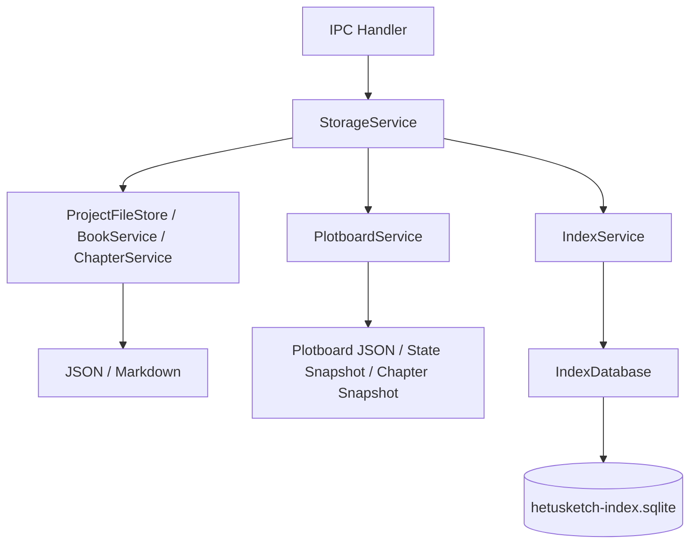

# storage 模块

## 职责

负责本地文件事实源、SQLite 派生索引、项目/设定/书目/章节/剧情画布 CRUD、导入导出、搜索、统计和索引同步。

## 依赖

- **上游模块**：Electron 主进程 IPC handler。
- **下游模块**：文件系统、SQLite、`AiService`、`FontService`、`PlotboardService`。

## 核心文件

| 文件 | 职责 |
| --- | --- |
| `src/main/services/storageService.ts` | 业务服务门面，聚合所有本地能力和剧情画布能力。 |
| `src/main/services/projectFileStore.ts` | 项目文件读写、条目读写、导入导出。 |
| `src/main/services/indexDatabase.ts` | SQLite schema、FTS5、配置、向量分块、剧情画布派生索引。 |
| `src/main/services/indexService.ts` | 启动扫描、文件监听、增量同步，包含画布和状态快照扫描。 |
| `src/main/services/bookService.ts` | 书目 manifest CRUD 与设定集绑定。 |
| `src/main/services/chapterService.ts` | 分卷/章节 CRUD、章节树、字数统计。 |
| `src/main/services/plotboardService.ts` | 画布、状态快照、正文快照、生成、校验、导出。 |
| `src/main/services/settingSetService.ts` | 设定集 CRUD。 |
| `src/main/services/storagePaths.ts` | 路径计算和安全边界，包含 plotboards/states/snapshots 路径。 |
| `src/main/services/entrySerialization.ts` | JSON/Markdown 条目序列化和解析。 |

## 数据流

## 对外接口

通过 `StorageService` 提供：

- `projects.*`
- `entries.*`
- `settingSets.*`
- `books.*`
- `chapters.*`
- `plotboards.*`
- `search.*`
- `dashboard.stats`
- `index.rebuild`
- `validation.basic/enhanced`
- AI/RAG 代理方法

## 剧情画布存储契约

- 画布事实源：`books/<bookId>/plotboards/<chapterId>.plotboard.json`。
- 状态快照事实源：`books/<bookId>/states/<chapterId>.state-snapshot.json`。
- 正文快照：`books/<bookId>/snapshots/<chapterId>.<snapshotId>.md`。
- 保存画布和状态快照后扫描书目，同步 `plotboard_cards_index`、`plotboard_time_index`、`state_snapshot_index`、`plot_thread_usage_index`。
- 未知字段保留，不在读写时丢弃。

## 已知问题

- SQLite 迁移目前以建表式为主，后续需引入 schema migration。
- 导入同 ID 项目需要更明确的冲突策略。
- 剧情画布的图片导出由渲染端生成 SVG，storage 模块仅负责 Markdown 大纲导出。