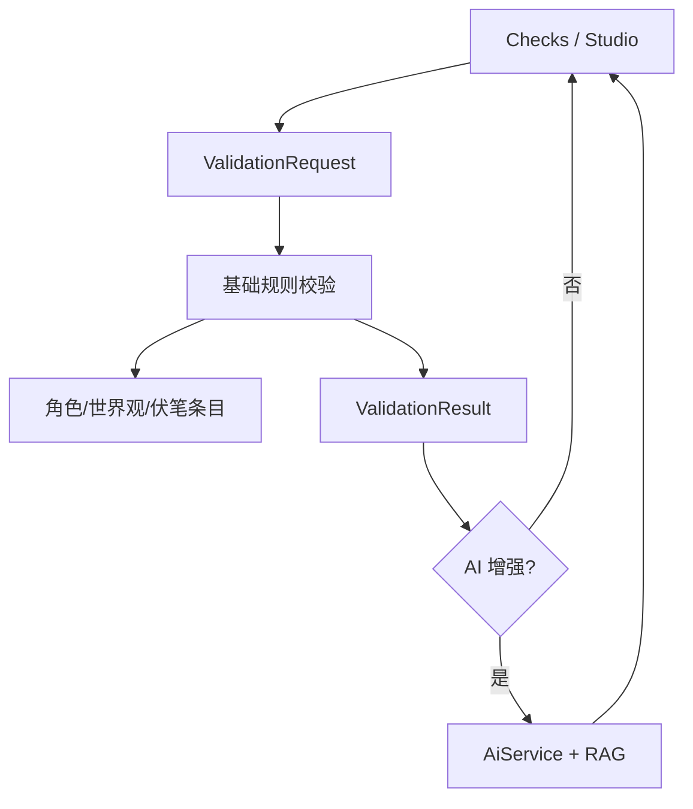

# validation 模块

## 职责

负责本地基础逻辑校验与 AI 增强校验，将角色红线、世界观规则和伏笔状态转换为可解释的 findings。

## 依赖

- **上游模块**：写作页、校验页、AI/RAG 调用入口。
- **下游模块**：`StorageService`、`IndexDatabase`、`ProjectFileStore`、`AiService`。

## 核心文件

| 文件 | 职责 |
| --- | --- |
| `src/main/services/storageService.ts` | 基础校验和增强校验编排。 |
| `src/main/services/aiService.ts` | AI 增强校验、伏笔提醒。 |
| `src/renderer/src/pages/ChecksPage.tsx` | 独立校验页。 |
| `src/renderer/src/pages/WritingStudioPage.tsx` | 写作页内校验入口。 |
| `src/shared/storageTypes.ts` | `ValidationRequest`、`ValidationResult`、`ValidationFinding` 类型。 |

## 数据流

## 对外接口

- `validation.basic(request): Promise<ValidationResult>`
- `validation.enhanced(request): Promise<AiAgentResponse<AiValidationResult>>`
- `ai.foreshadowing(projectId, text, requestId?)`
- `ai.streamValidation(...)`

## 已知问题

- 基础校验当前以关键词与 CJK n-gram 近似匹配为主，语义判断依赖 AI 增强。
- 规则缓存和预编译仍可优化。
