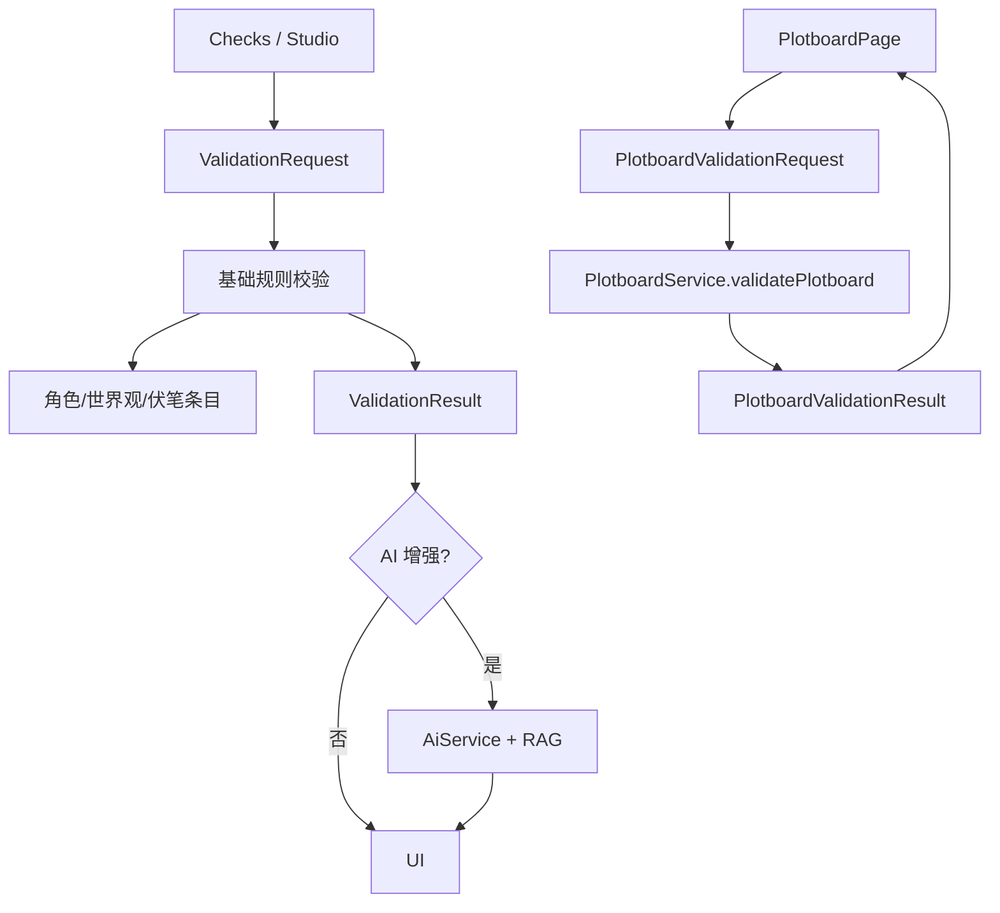

# validation 模块

## 职责

负责本地基础逻辑校验、AI 增强校验和剧情画布逻辑校验，将角色红线、世界观规则、伏笔状态、剧情卡时间线和状态变化转换为可解释的 findings。

## 依赖

- **上游模块**：写作页、校验页、剧情画布页、AI/RAG 调用入口。
- **下游模块**：`StorageService`、`IndexDatabase`、`ProjectFileStore`、`AiService`、`PlotboardService`。

## 核心文件

| 文件 | 职责 |
| --- | --- |
| `src/main/services/storageService.ts` | 基础校验、增强校验与剧情画布校验入口编排。 |
| `src/main/services/plotboardService.ts` | 剧情画布校验规则实现和 Markdown 段落定位。 |
| `src/main/services/aiService.ts` | AI 增强校验、伏笔提醒。 |
| `src/renderer/src/pages/ChecksPage.tsx` | 独立校验页。 |
| `src/renderer/src/pages/WritingStudioPage.tsx` | 写作页内校验入口。 |
| `src/renderer/src/pages/PlotboardPage.tsx` | 画布校验面板、卡片回跳、线索 resolved 更新入口。 |
| `src/shared/storageTypes.ts` | `ValidationRequest`、`ValidationResult`、`PlotboardValidationResult` 等类型。 |

## 数据流

## 对外接口

- `validation.basic(request): Promise<ValidationResult>`
- `validation.enhanced(request): Promise<AiAgentResponse<AiValidationResult>>`
- `plotboards.validate(request): Promise<PlotboardValidationResult>`
- `ai.foreshadowing(projectId, text, requestId?)`
- `ai.streamValidation(...)`

## 剧情画布校验规则

| 类别 | 规则示例 | 定位 |
| --- | --- | --- |
| `timeline` | 同一角色同一 timecode 出现在不同地点 | `cardId` + `relatedCardIds` |
| `character-state` | 已死亡角色继续出场；同一卡或并行卡重复修改同一状态字段 | `cardId` + `relatedCardIds` / `linkId` |
| `behavior-redline` | 剧情事实或正文可能触犯角色红线 | `entryId`、`rule`、`cardId` |
| `world-rule` | 剧情事实或正文可能违背绑定世界观规则 | `entryId`、`rule`、`cardId` |
| `plot-thread` | 线索回收早于埋设；重复回收 | `entryId`、`cardId` |
| `chapter-continuity` | 上一章快照地点与本章首卡地点不一致且缺少转场 | `chapterId`、`cardId` |

若请求包含 `markdown`，校验会尝试通过 `sourceCardId`、`data-card-id`、卡片标题或事实片段建立 `markdownLocation` 和 `markdownRange`。

## 已知问题

- 基础校验当前以关键词与 CJK n-gram 近似匹配为主，语义判断依赖 AI 增强。
- 规则缓存和预编译仍可优化。
- 剧情画布正文段落定位依赖标题/事实匹配，手写正文差异过大时可能只能回跳卡片。