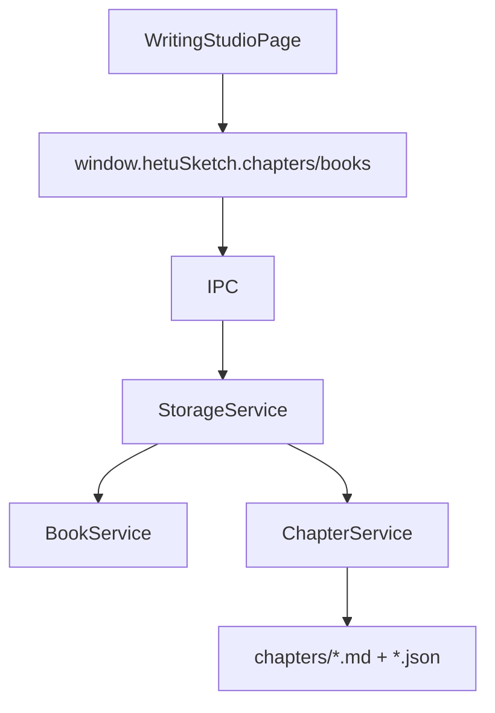

# writing-studio 模块

## 职责

负责书目、分卷、章节树与 Markdown 正文创作体验，包括编辑/预览/分屏、查找替换、章节状态和逻辑校验入口。

## 依赖

- **上游模块**：渲染端工作台路由、当前作品/书目状态。
- **下游模块**：IPC `books.*`、`chapters.*`、`validation.*`。

## 核心文件

| 文件 | 职责 |
| --- | --- |
| `src/renderer/src/pages/WritingStudioPage.tsx` | 写作编辑页面。 |
| `src/main/services/bookService.ts` | 书目 manifest 与设定集绑定。 |
| `src/main/services/chapterService.ts` | 分卷/章节 CRUD、字数统计、章节树。 |
| `src/shared/storageTypes.ts` | Book / Volume / Chapter 类型。 |

## 数据流

## 对外接口

- `books.list/get/create/update/delete/bindSettingSet`
- `chapters.listTree/createVolume/updateVolume/createChapter/updateChapter/moveChapter/deleteChapter`
- `validation.basic/enhanced`

## 已知问题

- 部分章节树迭代逻辑仍存在渲染端 localStorage 状态，需与主进程章节服务完全统一。
