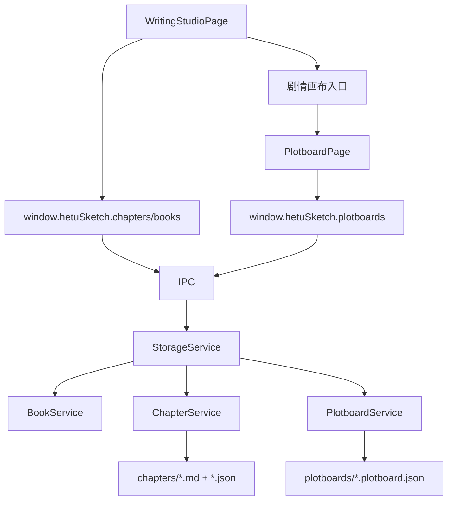

# writing-studio 模块

## 职责

负责书目、分卷、章节树与 Markdown 正文创作体验，包括编辑/预览/分屏、查找替换、章节状态、逻辑校验入口和剧情画布入口。

## 依赖

- **上游模块**：渲染端工作台路由、当前作品/书目状态。
- **下游模块**：IPC `books.*`、`chapters.*`、`validation.*`、`plotboards.*`。

## 核心文件

| 文件 | 职责 |
| --- | --- |
| `src/renderer/src/pages/WritingStudioPage.tsx` | 写作编辑页面与剧情画布入口。 |
| `src/renderer/src/pages/PlotboardPage.tsx` | 章节级剧情画布页面。 |
| `src/main/services/bookService.ts` | 书目 manifest 与设定集绑定。 |
| `src/main/services/chapterService.ts` | 分卷/章节 CRUD、字数统计、章节树。 |
| `src/main/services/plotboardService.ts` | 章节画布和生成正文写入支持。 |
| `src/shared/storageTypes.ts` | Book / Volume / Chapter / Plotboard 类型。 |

## 数据流

## 对外接口

- `books.list/get/create/update/delete/bindSettingSet`
- `chapters.listTree/createVolume/updateVolume/createChapter/updateChapter/moveChapter/deleteChapter`
- `plotboards.create/open/save/writeGeneratedMarkdown/saveChapterSnapshot`
- `validation.basic/enhanced`

## 剧情画布衔接规则

- 章节正文和剧情画布是两个不同层级：画布是结构层，Markdown 是稿件层。
- 用户手动修改 Markdown 不会反向修改剧情卡。
- 剧情画布生成或重写正文前默认保留旧正文快照。
- 生成正文写入章节后，章节状态变为 `drafting`。
- 返回章节入口使用同一 `chapterId`，不改变当前作品选择。

## 已知问题

- 部分章节树迭代逻辑仍存在渲染端 localStorage 状态，需与主进程章节服务完全统一。
- 从手写正文反向生成完整剧情画布不在当前范围。