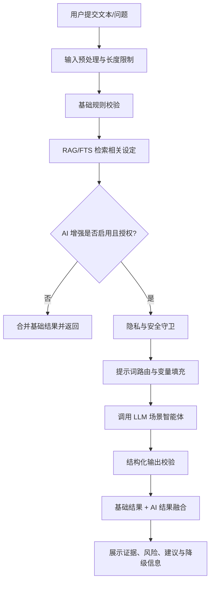

# HetuSketch 智能体调用与协作方案

## 1. 设计目标与原则

本方案对应 Task 2「输出智能体调用与协作方案」，依据《河图速写创作助手 PRD》与已批准规格 `build-hetusketch-system` 制定。HetuSketch 的 AI 能力定位为可选增强插件，核心原则如下：

- **逻辑监工，不做代笔**：智能体只做校验、检索、提醒、补全建议与工具编排，不直接替用户完成正文创作。
- **离线优先**：基础规则校验、SQLite/FTS 检索、设定管理不依赖网络或 LLM。
- **用户授权调用 AI**：仅在用户配置并启用 LLM/Embedding 服务后调用外部 API。
- **本地数据主权**：作品、角色、世界观、伏笔、索引与向量库默认保存在用户本地。
- **最小必要上下文**：AI 调用只发送完成当前任务所需的片段、召回设定和元数据，不上传完整作品库。
- **结构化输出可审计**：所有智能体返回统一 JSON 结果，包含证据、置信度、风险等级、建议动作与错误信息。

## 2. 智能体总览

| 智能体 | 主要职责 | 是否必须依赖 AI | 典型入口 |
| --- | --- | --- | --- |
| 逻辑校验智能体 `logic_check_agent` | 校验角色红线、世界观硬规则、情节一致性 | 否，AI 为增强模式 | 校验页面、右键/快捷校验 |
| RAG 检索智能体 `rag_retrieval_agent` | 召回与当前文本/问题相关的角色、世界观、伏笔设定 | 否，关键词/FTS 可降级；向量检索需 Embedding | AI 校验、问答、悬浮窗 |
| 设定补全智能体 `setting_completion_agent` | 根据用户草稿生成结构化设定补全建议 | 是 | 新建/编辑角色、世界观、伏笔页面 |
| 伏笔提醒智能体 `foreshadowing_agent` | 识别未回收伏笔、提醒可能回收/冲突/遗忘风险 | 否，AI 为增强模式 | Dashboard、校验页、写作片段检查 |
| 工具调用编排智能体 `tool_orchestration_agent` | 在权限范围内选择和调用内置技能或用户注册 HTTP 工具 | 是，且必须经工具策略网关 | AI 设置、校验结果动作、外部工具扩展 |
| 提示词路由智能体 `prompt_router_agent` | 选择全局/场景提示词模板并填充变量 | 否 | 所有 AI 调用前置流程 |
| 隐私与安全守卫 `privacy_guard_agent` | 脱敏、权限检查、上下文裁剪、工具调用拦截 | 否 | 所有 AI/API/工具调用前后 |

> 注：这里的“智能体”是服务边界和调用策略定义，不要求每个智能体都对应一个独立进程。MVP 可实现为主进程服务层中的独立模块，通过安全 IPC 暴露给渲染端。

## 3. 统一数据模型

### 3.1 通用请求字段

```ts
interface AgentRequestBase {
  requestId: string;
  projectId: string;
  userAction: string;
  locale: 'zh-CN' | 'en-US';
  aiMode: 'disabled' | 'assistive' | 'strict';
  source: 'main_window' | 'floating_window' | 'context_menu' | 'scheduled_check';
  privacyLevel: 'local_only' | 'allow_llm' | 'allow_embedding' | 'allow_tools';
}
```

### 3.2 通用响应字段

```ts
interface AgentResponseBase<T> {
  requestId: string;
  status: 'ok' | 'partial' | 'degraded' | 'blocked' | 'error';
  data?: T;
  warnings: string[];
  evidence: Array<{
    type: 'character' | 'world' | 'plot' | 'text_span' | 'tool_result';
    id?: string;
    title?: string;
    snippet: string;
    score?: number;
  }>;
  usage?: {
    provider?: string;
    model?: string;
    promptTokens?: number;
    completionTokens?: number;
    latencyMs?: number;
  };
  error?: {
    code: string;
    message: string;
    recoverable: boolean;
  };
}
```

### 3.3 风险等级

- `pass`：未发现冲突。
- `notice`：仅提示关联设定或弱风险，不阻断用户。
- `warning`：可能存在逻辑冲突，需要用户复核。
- `critical`：高置信度违反红线或硬规则。
- `unknown`：上下文不足或 AI/检索失败，无法判断。

## 4. 智能体定义

### 4.1 逻辑校验智能体 `logic_check_agent`

**职责**

- 对用户输入片段执行人设红线校验、世界观规则校验与情节一致性检查。
- 合并基础规则引擎和 AI 增强判断，输出可解释的冲突结果。
- 保持“校验与建议”边界，不生成正文替代段落。

**输入**

```ts
interface LogicCheckInput extends AgentRequestBase {
  text: string;
  scope: {
    characterIds?: string[];
    worldEntryIds?: string[];
    plotIds?: string[];
    checkTypes: Array<'character_redline' | 'world_rule' | 'plot_consistency'>;
  };
  retrievedContext?: RetrievedContext[];
  ruleMatches?: RuleMatch[];
}
```

**输出**

```ts
interface LogicCheckOutput {
  overallRisk: 'pass' | 'notice' | 'warning' | 'critical' | 'unknown';
  findings: Array<{
    checkType: 'character_redline' | 'world_rule' | 'plot_consistency';
    risk: 'pass' | 'notice' | 'warning' | 'critical' | 'unknown';
    targetId?: string;
    targetName?: string;
    textSpan?: { start: number; end: number; quote: string };
    violatedRule?: string;
    reason: string;
    suggestion?: string;
    confidence: number;
  }>;
}
```

**可调用技能/工具**

- `query_character`：读取指定角色详情、红线、关系。
- `query_world`：读取世界观条目和规则红线。
- `query_plot`：读取伏笔状态与描述。
- `rag_search`：召回相关设定片段。
- `basic_rule_check`：关键词/正则/结构化规则匹配。

**权限边界**

- 只读作品设定、索引和向量检索结果。
- 不允许写入、删除、导出项目文件。
- 不允许调用用户注册外部工具，除非结果页由用户明确点击“执行建议动作”。
- AI 输出只能作为建议，不能自动覆盖用户文本。

### 4.2 RAG 检索智能体 `rag_retrieval_agent`

**职责**

- 将校验文本、问题或关键词转化为检索查询。
- 综合 SQLite FTS5、元数据筛选、向量相似度召回相关设定。
- 对召回内容进行裁剪、去重、排序和证据打包。

**输入**

```ts
interface RagRetrievalInput extends AgentRequestBase {
  query: string;
  filters?: {
    entityTypes?: Array<'character' | 'world' | 'plot'>;
    ids?: string[];
    includeArchived?: boolean;
  };
  topK: number;
  retrievalMode: 'fts' | 'vector' | 'hybrid';
  maxContextChars: number;
}
```

**输出**

```ts
interface RetrievedContext {
  id: string;
  entityType: 'character' | 'world' | 'plot';
  title: string;
  snippet: string;
  sourcePath: string;
  score: number;
  matchReason: 'keyword' | 'vector' | 'relation' | 'recent_access' | 'manual_scope';
  fields: string[];
}
```

**可调用技能/工具**

- `sqlite_fts_search`：本地全文检索。
- `embedding_search`：本地向量库检索；需要用户已配置 Embedding API 并构建索引。
- `metadata_filter`：类型、标签、关系、状态筛选。
- `read_setting_file`：读取命中条目的完整详情并裁剪。

**权限边界**

- 只读项目文件和本地索引。
- Embedding 构建/查询只发送待嵌入文本块到用户配置的 Embedding 服务。
- 不把 API Key、系统路径、完整作品目录结构放入 LLM 上下文。
- 当向量索引过期时，仅返回“索引需更新”状态，不自动重建，除非用户开启自动/定时更新。

### 4.3 设定补全智能体 `setting_completion_agent`

**职责**

- 根据用户输入的草稿、已有设定和字段模板，生成角色/世界观/伏笔的结构化补全建议。
- 帮助新手建立规范设定，但最终保存必须由用户确认。

**输入**

```ts
interface SettingCompletionInput extends AgentRequestBase {
  entityType: 'character' | 'world' | 'plot';
  draft: string;
  existingFields?: Record<string, unknown>;
  relatedContext?: RetrievedContext[];
  targetSchema: Record<string, unknown>;
  completionGoal: 'fill_empty_fields' | 'expand_red_lines' | 'suggest_relations' | 'normalize_tags';
}
```

**输出**

```ts
interface SettingCompletionOutput {
  proposedFields: Record<string, unknown>;
  missingQuestions: string[];
  possibleConflicts: Array<{
    field: string;
    reason: string;
    relatedEvidenceId?: string;
  }>;
  adoptionMode: 'manual_review_required';
}
```

**可调用技能/工具**

- `rag_search`：查找相邻设定以避免补全冲突。
- `query_character` / `query_world` / `query_plot`：读取已关联设定。
- `schema_validate`：校验输出是否符合实体字段规范。

**权限边界**

- 不自动保存补全内容。
- 不生成正文剧情段落，只生成设定字段建议、问题清单和风险提示。
- 不允许调用外部工具。
- 输出必须标记为“待用户审阅”。

### 4.4 伏笔提醒智能体 `foreshadowing_agent`

**职责**

- 识别当前文本与未回收伏笔之间的关联。
- 提醒可能需要回收、可能遗忘、状态冲突或与废弃伏笔矛盾的线索。
- 在 Dashboard 展示未回收伏笔统计和高优先级提醒。

**输入**

```ts
interface ForeshadowingInput extends AgentRequestBase {
  text?: string;
  currentChapter?: string;
  targetPlotIds?: string[];
  includeStatuses: Array<'unresolved' | 'resolved' | 'abandoned'>;
  retrievedContext?: RetrievedContext[];
}
```

**输出**

```ts
interface ForeshadowingOutput {
  reminders: Array<{
    plotId: string;
    plotName: string;
    status: 'unresolved' | 'resolved' | 'abandoned';
    reminderType: 'possible_payoff' | 'overdue' | 'contradiction' | 'related_context';
    reason: string;
    confidence: number;
    suggestedAction: 'review' | 'mark_resolved' | 'ignore_once' | 'edit_plot';
  }>;
}
```

**可调用技能/工具**

- `query_plot`：读取伏笔详情与状态。
- `rag_search`：语义召回相关伏笔。
- `basic_rule_check`：关键词命中角色、事件、道具、章节信息。
- `notification_preview`：生成系统通知预览，不直接发送。

**权限边界**

- 不自动修改伏笔状态。
- 不自动弹出打扰式提醒，通知策略由用户设置控制。
- 对废弃伏笔仅提示风险，不恢复状态。

### 4.5 工具调用编排智能体 `tool_orchestration_agent`

**职责**

- 根据用户明确授权和当前场景，选择可调用技能或注册工具。
- 将 LLM 的工具调用意图转化为受控的内部技能调用或 HTTP 回调。
- 执行调用前权限校验、参数校验、频率限制和审计记录。

**输入**

```ts
interface ToolOrchestrationInput extends AgentRequestBase {
  intent: string;
  candidateTools: string[];
  arguments: Record<string, unknown>;
  userConfirmed: boolean;
  dryRun: boolean;
}
```

**输出**

```ts
interface ToolOrchestrationOutput {
  selectedTool?: string;
  executed: boolean;
  dryRunResult?: unknown;
  result?: unknown;
  audit: {
    permissionChecked: boolean;
    userConfirmed: boolean;
    argumentsValidated: boolean;
    redactedFields: string[];
  };
}
```

**可调用技能/工具**

内置技能：

- `query_character`
- `query_world`
- `query_plot`
- `check_plot_conflict`
- `save_snapshot`（高风险写操作，必须二次确认）
- `export_report`（导出校验报告，必须由用户指定路径）

用户注册工具：

- 仅 MVP 支持 HTTP callback 工具。
- 工具定义必须包含名称、描述、JSON Schema 参数、允许域名/Base URL、超时时间、是否需要确认。

**权限边界**

- 默认只允许只读技能。
- 写入、导出、外部 HTTP 工具必须经过用户显式确认。
- 禁止任意本地命令执行、任意文件路径访问、读取环境变量、读取 API Key。
- 禁止将完整项目打包发送给外部工具。
- 工具调用结果回传 LLM 前必须脱敏和裁剪。

### 4.6 提示词路由智能体 `prompt_router_agent`

**职责**

- 按场景选择全局默认提示词或用户配置的场景提示词。
- 填充允许的变量并拒绝未授权变量。
- 注入输出 JSON Schema、隐私约束和“不得代笔”约束。

**输入**

```ts
interface PromptRouterInput extends AgentRequestBase {
  scenario: 'character_check' | 'world_check' | 'plot_reminder' | 'setting_completion' | 'rag_qa' | 'tool_use';
  templateId?: string;
  variables: Record<string, string>;
  outputSchemaName: string;
}
```

**输出**

```ts
interface PromptRouterOutput {
  systemPrompt: string;
  userPrompt: string;
  filledVariables: string[];
  blockedVariables: string[];
  outputSchema: Record<string, unknown>;
}
```

**可调用技能/工具**

- `load_prompt_template`
- `validate_prompt_variables`
- `render_prompt`
- `inject_output_schema`

**权限边界**

- 不读取业务文件，只接收上游已筛选上下文。
- 不允许模板访问 API Key、系统环境变量或任意文件路径。
- 用户自定义提示词不能覆盖系统级安全约束。

### 4.7 隐私与安全守卫 `privacy_guard_agent`

**职责**

- 在 LLM、Embedding、工具调用前执行隐私策略检查。
- 对文本、上下文、工具参数进行裁剪、脱敏与拦截。
- 在调用后过滤敏感响应与错误信息。

**输入**

```ts
interface PrivacyGuardInput extends AgentRequestBase {
  operation: 'llm_call' | 'embedding_call' | 'tool_call' | 'export' | 'index_build';
  payload: unknown;
  policy: {
    maxChars: number;
    allowExternalNetwork: boolean;
    allowSensitiveFields: boolean;
    requireConfirmation: boolean;
  };
}
```

**输出**

```ts
interface PrivacyGuardOutput {
  decision: 'allow' | 'redact' | 'block' | 'require_confirmation';
  sanitizedPayload?: unknown;
  redactions: Array<{ path: string; reason: string }>;
  reason?: string;
}
```

**可调用技能/工具**

- `redact_api_keys`
- `truncate_context`
- `validate_tool_domain`
- `permission_check`
- `write_audit_log`

**权限边界**

- 只做策略检查、脱敏和审计。
- 不调用 LLM，不写业务设定内容。
- 审计日志不得记录 API Key、完整正文或敏感工具参数。

## 5. 基础规则校验与 AI 增强校验协作流程

### 5.1 总体链路



### 5.2 人设红线校验流程

1. 用户输入片段并选择角色或“全部角色”。
2. 基础规则引擎读取角色红线，执行关键词、别名、否定词、正则规则匹配。
3. RAG 检索智能体召回相关角色背景、关系、红线和最近访问设定。
4. 若 AI 未启用：直接返回基础命中结果，标注为 `rule_based`。
5. 若 AI 启用：隐私守卫裁剪文本和设定片段，提示词路由加载“人设校验”模板。
6. 逻辑校验智能体调用 LLM 判断语义冲突，返回结构化 findings。
7. 结果融合器将规则命中作为强证据，AI 结论作为语义增强；冲突结论必须附带文本片段和设定证据。

### 5.3 世界观规则校验流程

1. 基础引擎根据世界观类别、规则红线关键词、实体别名召回候选规则。
2. RAG 检索智能体补充语义相近规则，例如“复生”“还魂”匹配“不能复活死者”。
3. AI 增强模式下，逻辑校验智能体只判断“输入描述是否违反已给规则”，不得自行创造新规则。
4. 若 AI 给出无证据结论，结果融合器降级为 `unknown` 或 `notice`。

### 5.4 伏笔提醒流程

1. Dashboard 定时或用户提交文本时读取未回收伏笔列表。
2. 基础规则引擎按角色、道具、事件、章节字段命中可能相关伏笔。
3. RAG 检索智能体执行向量/混合召回，补充未命中关键词但语义相关的伏笔。
4. 伏笔提醒智能体输出提醒类型：可能回收、逾期、冲突、相关背景。
5. 用户可选择查看、忽略一次、编辑伏笔或手动标记已回收；系统不自动改状态。

### 5.5 设定补全流程

1. 用户在新建/编辑页面输入草稿并点击“AI 辅助”。
2. RAG 检索智能体召回同作品相关角色、世界观、伏笔，避免补全冲突。
3. 提示词路由加载对应实体的补全模板和字段 Schema。
4. 设定补全智能体返回 `proposedFields`、`missingQuestions`、`possibleConflicts`。
5. 前端以差异预览展示，用户逐项采纳后才能保存。

### 5.6 工具调用流程

1. LLM 输出工具调用意图，或用户在结果页点击建议动作。
2. 工具调用编排智能体检查工具是否在当前 agent 的允许清单中。
3. 隐私与安全守卫校验参数、域名、权限、是否需要二次确认。
4. 对外部 HTTP 工具先执行 `dryRun` 或显示调用预览。
5. 用户确认后执行工具；工具结果裁剪脱敏后写入审计记录并返回 UI。

## 6. 提示词变量规范

### 6.1 允许变量

| 变量 | 含义 | 适用场景 |
| --- | --- | --- |
| `{{project_name}}` | 当前作品名称 | 全部 |
| `{{user_text}}` | 用户提交的待校验文本或草稿 | 校验、补全、伏笔提醒 |
| `{{role_name}}` | 角色名称 | 人设校验、设定补全 |
| `{{character_profile}}` | 裁剪后的角色设定 | 人设校验、补全 |
| `{{character_red_lines}}` | 角色行为红线 | 人设校验 |
| `{{world_rules}}` | 裁剪后的世界观规则 | 世界观校验 |
| `{{plot_clues}}` | 裁剪后的伏笔列表 | 伏笔提醒 |
| `{{retrieved_context}}` | RAG/FTS 召回证据 | AI 校验、问答、补全 |
| `{{current_chapter}}` | 当前章节标识 | 伏笔提醒 |
| `{{output_schema}}` | 本次任务强制 JSON Schema | 全部 AI 场景 |
| `{{tool_manifest}}` | 当前允许工具清单 | 工具调用场景 |

### 6.2 禁止变量

- `{{api_key}}`、`{{embedding_key}}`、`{{provider_secret}}`
- `{{absolute_project_path}}`、`{{user_home}}`、`{{env}}`
- `{{full_project_dump}}`、`{{all_files}}`
- 未经上游检索和裁剪的完整正文、完整作品库、完整导出包

### 6.3 系统级提示词约束

每个场景提示词最终都必须叠加以下系统约束：

```text
你是 HetuSketch 的逻辑监工，不是代笔工具。只能基于用户提供的文本与检索到的设定做校验、解释、提醒和结构化建议。不得编造不存在的设定，不得要求用户上传完整作品，不得输出 API Key、文件系统路径或敏感配置。若证据不足，返回 unknown 并说明需要哪些信息。输出必须符合给定 JSON Schema。
```

## 7. 工具调用约束

### 7.1 工具分级

| 等级 | 类型 | 示例 | 确认要求 |
| --- | --- | --- | --- |
| L0 | 只读本地查询 | `query_character`、`query_world`、`query_plot` | 不需要二次确认 |
| L1 | 本地计算/校验 | `basic_rule_check`、`schema_validate`、`rag_search` | 不需要二次确认 |
| L2 | 受控写入 | `save_snapshot`、`mark_plot_resolved` | 必须用户确认 |
| L3 | 导出/外部网络 | `export_report`、HTTP callback 工具 | 必须用户确认，需域名白名单 |
| L4 | 高风险能力 | 任意命令执行、任意文件读写、读取环境变量 | MVP 禁止 |

### 7.2 调用硬性规则

- LLM 不能直接执行工具，只能提出结构化工具调用请求。
- 所有工具调用必须经过 `tool_orchestration_agent` 和 `privacy_guard_agent`。
- 外部 HTTP 工具必须配置 JSON Schema 参数，不接受自由文本拼接 URL。
- 默认超时 30 秒；失败最多重试 1 次，只对幂等只读请求重试。
- 工具调用审计记录包含工具名、时间、调用方、权限结果、脱敏参数摘要和执行状态。
- 禁止工具读取或返回 API Key、系统凭据、环境变量、任意本地文件内容。

## 8. 失败降级策略

| 失败点 | 降级行为 | 用户提示 |
| --- | --- | --- |
| 未配置 LLM | 使用基础规则校验和 FTS 检索 | “AI 增强未启用，当前为离线基础校验。” |
| LLM 连接失败/超时 | 返回基础规则结果，AI 状态为 `degraded` | “AI 服务暂不可用，已保留本地校验结果。” |
| Embedding 未配置 | 使用 SQLite FTS5 和关系筛选 | “向量检索未启用，结果可能缺少语义近似匹配。” |
| 向量索引过期 | 使用旧索引或 FTS，标记 `partial` | “知识库索引可能不是最新，请更新向量索引。” |
| LLM 输出非 JSON | 尝试一次格式修复；失败则舍弃 AI 结果 | “AI 返回格式异常，已回退到基础校验。” |
| 工具权限不足 | 阻断调用 | “该工具不在当前智能体权限范围内。” |
| 外部工具失败 | 不影响基础结果，记录错误 | “外部工具调用失败，未修改本地数据。” |
| 上下文超长 | 按相关度裁剪，保留证据摘要 | “上下文已按相关度裁剪，建议缩小校验范围。” |
| 隐私策略阻断 | 不发起外部调用 | “当前隐私设置不允许发送该内容到外部服务。” |

## 9. 隐私边界

### 9.1 本地保存

- 作品数据：JSON/Markdown 文件作为唯一数据源。
- 检索索引：SQLite FTS5 元数据与全文索引。
- 向量索引：sqlite-vss 或 hnswlib 本地持久化。
- API Key：系统凭据管理器或本地加密存储，不写入导出包。
- 审计日志：仅存脱敏摘要，不存完整正文和密钥。

### 9.2 可发送到外部服务的内容

仅在用户启用对应能力后发送：

- LLM：用户当前提交文本、裁剪后的相关设定、输出 Schema、场景提示词。
- Embedding：待索引或待查询的文本块；不包含 API Key 明文和无关文件内容。
- HTTP 工具：经过 JSON Schema 校验和脱敏的参数。

### 9.3 不得发送的内容

- API Key、Embedding Key、代理认证信息。
- 完整作品目录、完整导出包、未经用户选择的全部文件。
- 系统用户名、用户主目录、环境变量、绝对路径。
- 用户未授权发送的其他作品数据。

## 10. MVP 实现建议

1. 先实现 `basic_rule_check`、`sqlite_fts_search`、`query_*` 只读技能，保证离线闭环。
2. 再实现 LLM 适配器、提示词路由和结构化输出校验，接入 `logic_check_agent`。
3. Embedding 与向量索引作为独立服务，先支持手动构建/更新，避免后台隐式上传。
4. 工具调用 MVP 仅开放只读内置技能和用户确认后的 HTTP callback，禁止本地命令执行。
5. 所有 AI 结果在 UI 上显示“AI 增强建议”标签，并提供证据来源与降级状态。
6. 对严重冲突建议提供“保存快照”“打开相关设定”“复制校验报告”等用户主动动作，不自动修改正文或设定。

## 11. 验收检查清单

- [x] 已定义逻辑校验、RAG 检索、设定补全、伏笔提醒、工具调用等智能体。
- [x] 已明确各智能体输入输出、可调用技能/工具、权限边界。
- [x] 已设计基础规则校验与 AI 增强校验的协作流程。
- [x] 已覆盖失败降级策略、隐私边界、提示词变量和工具调用约束。
- [x] 未修改 `.trae/specs` 下的任务状态文件。
