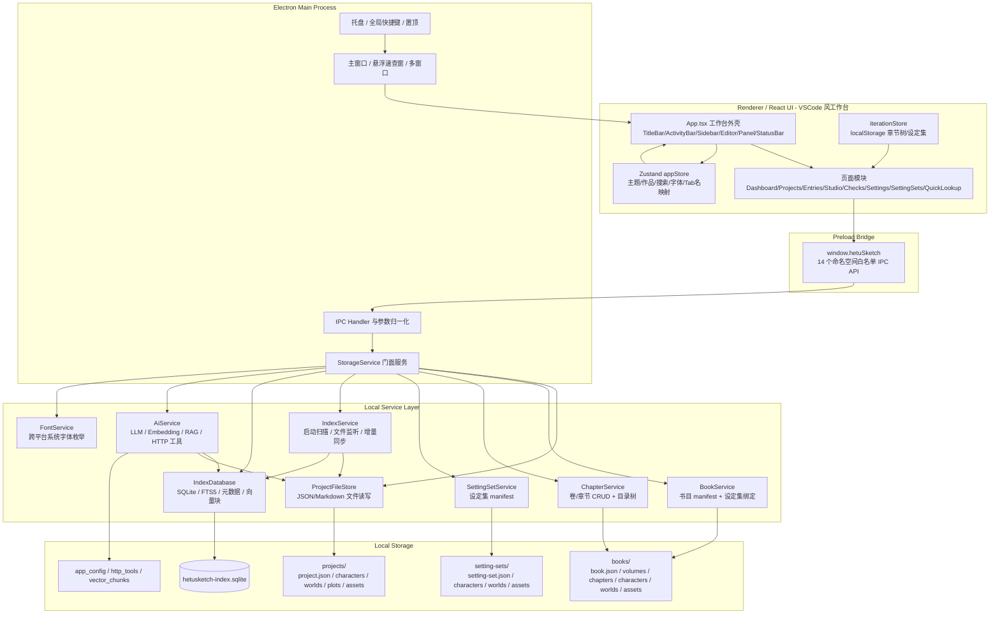
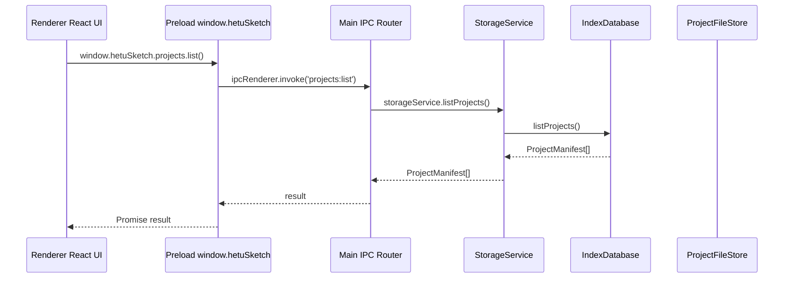
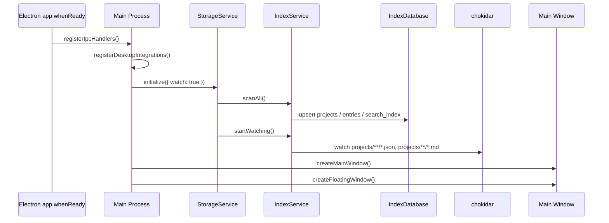
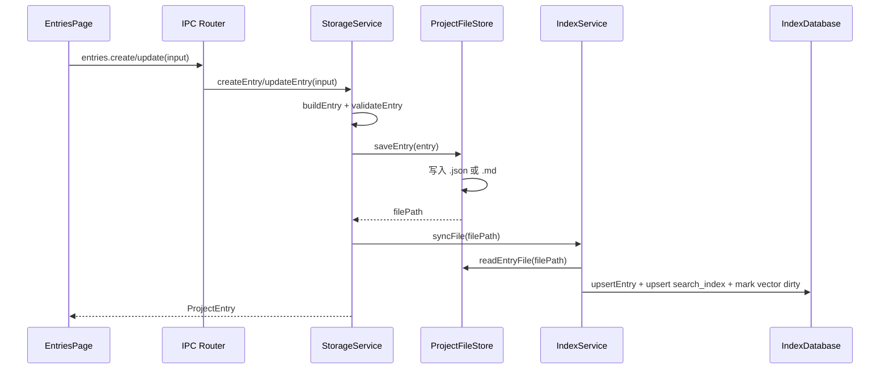
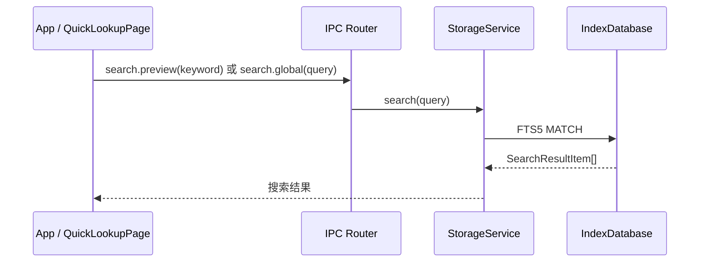
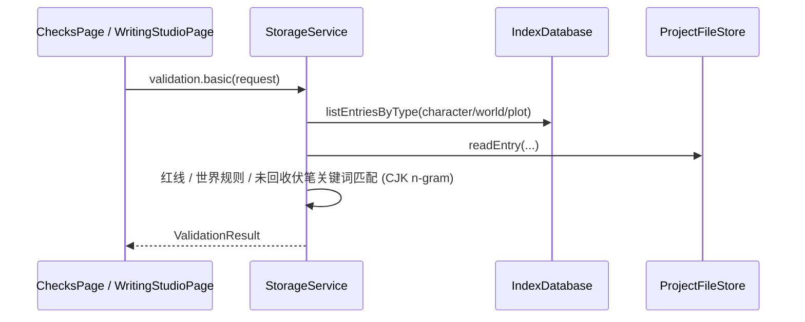
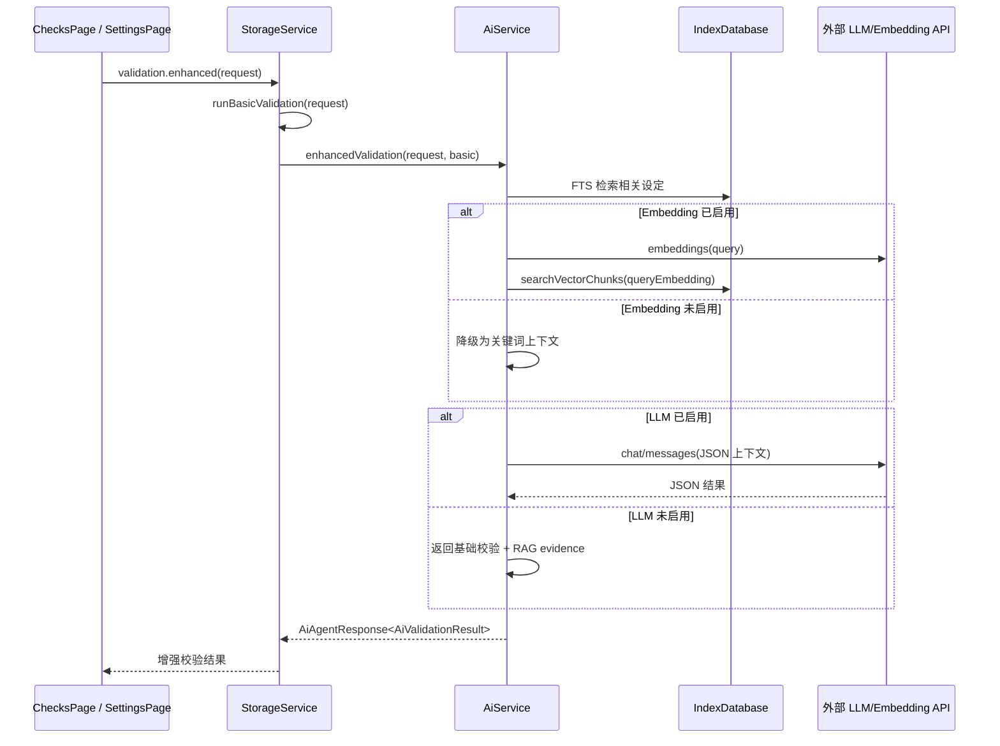
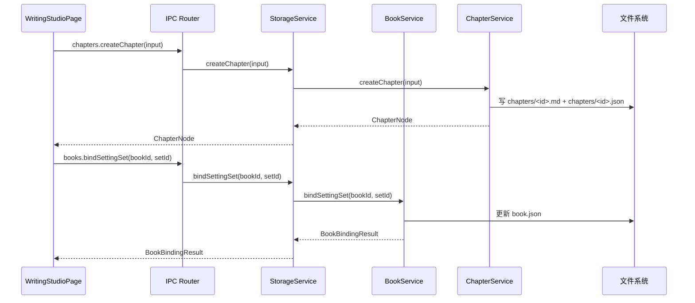

# 河图速写创作助手技术选型与系统架构

## 1. 文档范围与当前架构状态

本文档描述 HetuSketch 当前代码库的实际架构状态，覆盖系统组件、模块划分、技术栈选型、数据流、接口定义、依赖关系、安全边界与后续优化建议。

当前项目是一个 **Electron 桌面应用**，采用 **主进程服务层 + Preload 安全桥 + React 渲染端** 的三层架构。用户作品数据以本地 JSON/Markdown 文件为事实数据源，SQLite/FTS5 作为派生索引与查询加速层，AI/RAG 能力作为可选增强模块存在。渲染端采用 **VSCode 风工作台外壳**，由活动栏、主/辅侧边栏、多 Tab 可分割编辑器、底部面板与状态栏组成。

核心架构原则：

- 本地优先：作品、设定、索引与配置均存储在用户本机。
- 文件为事实源：JSON/Markdown 文件保存真实用户内容；SQLite 可重建。
- 渲染端无 Node 权限：渲染进程通过 preload 暴露的白名单 API 调用主进程能力。
- AI 可选启用：未配置 API Key 时基础功能仍可运行，AI/RAG 降级为关键词检索或基础校验。
- 类型共享：主进程、preload、渲染端共用 `src/shared` 中的 IPC 与数据类型定义。
- 四级创作链路：设定集（SettingSet）→ 作品（Project）→ 书目（Book）→ 章节（Chapter）。

## 2. 总体架构图



## 3. 技术栈与选型理由

| 层面 | 当前选型 | 代码位置 / 配置 | 选型理由 |
| --- | --- | --- | --- |
| 桌面运行时 | Electron 33 + TypeScript | `package.json`, `src/main/index.ts` | 支持 Windows 桌面窗口、托盘、全局快捷键、置顶窗口、多窗口、系统文件访问与本地数据库集成。 |
| 构建工具 | electron-vite 3 + Vite 6 | `electron.vite.config.ts`, `package.json` | 同时构建 main、preload、renderer，开发体验和 React 集成成熟。 |
| UI 框架 | React 18 + TypeScript 5.7 | `src/renderer/src` | 适合复杂桌面工具 UI、页面路由、组件化表单与检索界面。 |
| UI 组件 | Ant Design 5 + Icons | `package.json`, 各页面组件 | 提供表单、布局、菜单、卡片、列表、Tag、Modal、Tabs、Dropdown 等桌面管理型组件。 |
| 路由 | React Router DOM 6 | `src/renderer/src/App.tsx` | 用于主窗口内 Dashboard、设定数据、文本编辑器、校验、设置等页面切换，支持 URL query 参数。 |
| 状态管理 | Zustand 5 | `src/renderer/src/store/appStore.ts` | 轻量管理主题、当前作品、搜索关键词、字体设置、侧边栏刷新、Tab 名映射。 |
| 本地事实存储 | JSON / Markdown 文件 | `ProjectFileStore`, `BookService`, `ChapterService`, `SettingSetService`, `entrySerialization.ts` | 数据透明、可读、可导入导出，适合离线优先和用户数据主权。 |
| 本地索引 | better-sqlite3 + SQLite FTS5 | `IndexDatabase` | 提供元数据表、全文检索、最近访问、统计、向量块存储。 |
| 文件监听 | chokidar 5 | `IndexService` | 监听作品目录下 JSON/Markdown 变化并增量同步索引。 |
| 压缩导入导出 | adm-zip | `ProjectFileStore` | 支持作品 Zip 导入导出。 |
| AI 能力 | fetch + OpenAI 兼容 / Anthropic 协议 | `AiService` | 通过用户配置 Base URL、模型与 API Key 接入 LLM 和 Embedding。 |
| 系统字体 | PowerShell / fc-list | `FontService` | 跨平台枚举系统已安装字体，供用户自定义功能栏与编辑区字体。 |
| 测试 | Vitest + Testing Library + jsdom | `vitest.config.ts`, `*.test.ts` | 覆盖主进程服务、序列化、存储路径、React App 基础渲染。 |
| 打包 | electron-builder / NSIS | `package.json` build 字段 | 生成 Windows 安装包，支持自定义安装目录。 |

## 4. 代码模块划分

```text
src/
├── main/
│   ├── index.ts                      # Electron 主进程：窗口、托盘、快捷键、IPC 注册
│   ├── services/
│   │   ├── storageService.ts          # 业务服务门面：项目、条目、书目、章节、设定集、搜索、校验、导入导出、AI/RAG
│   │   ├── projectFileStore.ts        # 作品文件系统读写、导入导出、Zip 安全校验
│   │   ├── bookService.ts             # 书目 manifest CRUD、设定集绑定
│   │   ├── chapterService.ts          # 卷/章节 CRUD、目录树装配、字数统计
│   │   ├── settingSetService.ts       # 设定集 manifest CRUD
│   │   ├── indexDatabase.ts           # SQLite schema、FTS5、元数据、向量块、配置表
│   │   ├── indexService.ts            # 启动扫描、项目扫描、文件监听、增量索引同步
│   │   ├── aiService.ts               # AI 配置、密钥加密、LLM、Embedding、RAG、HTTP 工具
│   │   ├── fontService.ts             # 跨平台系统字体枚举
│   │   ├── entrySerialization.ts      # JSON/Markdown 条目序列化、解析、可搜索文本提取
│   │   └── storagePaths.ts            # userData/data 路径、项目/设定集/书目目录、路径安全断言
│   └── test/                          # Electron / SQLite / chokidar / adm-zip 测试替身
├── preload/
│   └── index.ts                       # contextBridge 暴露 window.hetuSketch（14 个命名空间）
├── renderer/
│   ├── index.html
│   ├── src/
│   │   ├── App.tsx                    # 工作台外壳：TitleBar/ActivityBar/PrimarySidebar/EditorWorkbench/SecondarySidebar/BottomPanel/StatusBar/Sash
│   │   ├── main.tsx                   # React 入口
│   │   ├── styles.css                 # 全局样式与工作台 Grid 布局
│   │   ├── store/appStore.ts          # Zustand 全局 UI 状态（主题/作品/搜索/字体/Tab名映射/侧栏刷新）
│   │   ├── iterationStore.ts          # localStorage 迭代状态：章节树、设定集
│   │   ├── pages/                     # Dashboard/Projects/Entries/Checks/Settings/SettingSets/QuickLookup/WritingStudio
│   │   └── components/                # RelationshipCanvas 关系图谱等复用组件
│   └── test/setup.ts
└── shared/
    ├── ipc.ts                         # IPC channel 常量与 HetuSketchApi 类型（14 个命名空间）
    └── storageTypes.ts                # 项目、设定集、书目、章节、条目、搜索、校验、AI、RAG 等共享类型
```

## 5. 进程与安全边界

### 5.1 Electron 进程架构



主进程负责：

- 创建主窗口（无边框，1280×820）与悬浮速查窗口（420×560，alwaysOnTop、skipTaskbar）。
- 支持通过 `desktop.openWindow(path)` 新开窗口（兼容 dev/prod 路由）。
- 注册系统托盘和 `CommandOrControl+Shift+H` 全局快捷键。
- 实现窗口显示、隐藏、置顶状态控制、最小化、最大化、关闭。
- 注册所有 IPC handler，并进行基础参数归一化和限制。
- 持有 `StorageService`，统一执行文件、数据库、AI 网络访问。

渲染进程负责：

- React 工作台外壳展示和交互。
- 调用 `window.hetuSketch` 提供的安全 API。
- 管理 UI 状态、当前作品、搜索关键词、主题、字体、Tab 名映射与局部 localStorage 状态。
- 不直接访问 Node.js、文件系统、SQLite 或 API Key。

当前窗口安全配置：

- `contextIsolation: true`
- `nodeIntegration: false`
- `sandbox: true`
- `webSecurity: true`
- 外链通过 `shell.openExternal` 打开，并拒绝在 Electron 内新开窗口。

## 6. 存储架构

### 6.1 文件系统事实数据源

应用数据根目录由 `app.getPath('userData')` 推导，当前结构为：

```text
<userData>/data/
├── hetusketch-index.sqlite
├── projects/
│   └── <projectId>/
│       ├── project.json
│       ├── characters/<entryId>.json 或 <entryId>.md
│       ├── worlds/<entryId>.json 或 <entryId>.md
│       ├── plots/<entryId>.json 或 <entryId>.md
│       └── assets/
├── setting-sets/
│   └── <setId>/
│       ├── setting-set.json
│       ├── characters/
│       ├── worlds/
│       └── assets/
└── books/
    └── <bookId>/
        ├── book.json
        ├── volumes/<volId>.json
        ├── chapters/<chId>.md
        ├── chapters/<chId>.json
        ├── characters/
        ├── worlds/
        └── assets/
```

事实数据模型：

- `project.json` 保存 `ProjectManifest`（`schemaVersion: 1`），包括 `id`、`name`、`type`、`summary`、`createdAt`、`updatedAt`。
- `setting-set.json` 保存 `SettingSetManifest`（`schemaVersion: 2`），用于跨作品共享全局设定。
- `book.json` 保存 `BookManifest`（`schemaVersion: 2`），包含 `settingSetId` 绑定字段。
- 章节同时保存 `.md`（正文）与 `.json`（元数据：status、order、关联角色/世界/伏笔 ID）。
- 设定条目分为 `character`、`world`、`plot` 三类。
- 条目支持 `json` 与 `markdown` 两种格式。
- Markdown 条目使用 JSON frontmatter 保存结构化字段，正文保存为 Markdown content。
- 文件路径通过 `assertSafeSegment` 与 `assertInside` 限制，降低路径穿越风险。

### 6.2 SQLite 派生索引

SQLite 文件为 `hetusketch-index.sqlite`，由 `IndexDatabase` 初始化，启用：

- `journal_mode = WAL`
- `foreign_keys = ON`
- FTS5 虚拟表 `search_index`（unicode61 分词）

主要表：

| 表 / 索引 | 职责 |
| --- | --- |
| `projects` | 作品元数据、根路径、manifest 路径。 |
| `entries` | 条目摘要、类型、标签、文件路径、可搜索正文。 |
| `relations` | 条目之间的关系边。 |
| `recent_access` | 最近访问记录。 |
| `file_index` | 文件 hash、mtime、size、索引状态，用于增量扫描。 |
| `app_config` | AI 模型配置、提示词、技能开关等配置。 |
| `http_tools` | 用户注册的 HTTP 工具配置。 |
| `vector_chunks` | RAG 分块文本与 embedding JSON。 |
| `vector_index_state` | 向量索引状态、dirty 标记、构建统计与警告。 |
| `search_index` | FTS5 全文检索索引，覆盖 title、summary、content、tags。 |

一致性策略：

1. 写入项目或条目时，先写文件系统，再调用 `IndexService.syncFile()` 更新 SQLite。
2. 应用启动时执行 `StorageService.initialize({ watch: true })`，先全量扫描，再启动监听。
3. 文件监听覆盖 `projects/**/*.json` 与 `projects/**/*.md`，对 add/change/unlink 做 150ms 合并同步。
4. SQLite 仅为派生索引；损坏或不同步时可通过 `index.rebuild()` 从文件重建。

### 6.3 渲染端 localStorage 状态

`iterationStore.ts` 当前将部分迭代功能保存在浏览器 `localStorage`：

- 章节树 `ChapterNode`（book/volume/chapter 三级）
- 设定集 `SettingSet`（与主进程 `SettingSetService` 并行存在的前端副本）

`appStore.ts` 持久化到 localStorage 的状态：

- `hetusketch.workbench.theme.v1`：主题模式
- `hetusketch.workbench.fonts.v1`：功能栏与编辑区字体设置
- `hetusketch.workbench.layout.v1`：工作台布局（各区域宽度/高度/显隐/分割模式）
- `hetusketch.workbench.activity.v1`：活动栏顺序
- `hetusketch.workbench.sidebarView.v1`：当前侧边栏视图
- `hetusketch.workbench.tabs.v1`：主编辑器 Tab 列表
- `hetusketch.workbench.secondaryGroups.v1`：辅助编辑器组状态
- `hetusketch.workbench.sidebarFolders.v1`：侧边栏文件夹结构

这部分数据尚未完全纳入主进程文件事实源与 SQLite 索引体系，属于当前架构中的临时前端持久化状态。

## 7. 核心服务说明

### 7.1 StorageService

`StorageService` 是主进程业务门面，聚合：

- `ProjectFileStore`
- `BookService`
- `ChapterService`
- `SettingSetService`
- `IndexDatabase`
- `IndexService`
- `AiService`
- `FontService`

主要职责：

- 初始化存储目录、扫描索引、启动/停止监听。
- 设定集 CRUD。
- 书目 CRUD 与设定集绑定。
- 卷/章节 CRUD、目录树装配、章节移动。
- 项目 CRUD、导入、导出。
- 条目 CRUD、读取详情、记录最近访问。
- 搜索、最近访问、Dashboard 统计。
- 基础逻辑校验（`runBasicValidation`：角色红线、世界观规则、未回收伏笔的关键词与 CJK n-gram 匹配）。
- AI 配置、提示词、技能、HTTP 工具、连接测试。
- RAG 构建、RAG 查询、RAG 问答、AI 增强校验、设定补全、伏笔提醒。
- 系统字体枚举。

### 7.2 ProjectFileStore

文件存储层负责：

- 创建项目目录结构。
- 写入和读取 `project.json`。
- 保存、读取、删除 JSON/Markdown 条目。
- 枚举项目和条目文件。
- 导出项目 Zip。
- 从文件夹或 Zip 导入项目。
- 校验 Zip entry，拒绝 `..`、绝对路径和 Windows 盘符路径。
- 提供文件 `sha256 + mtimeMs` 统计，供增量索引使用。

### 7.3 BookService

书目服务负责：

- 书目 manifest 的 CRUD（`booksRoot/<bookId>/book.json`，`schemaVersion: 2`）。
- 创建书目时生成 `volumes/chapters/characters/worlds/assets` 子目录。
- `bindSettingSet(bookId, settingSetId)`：更新 `settingSetId` 字段并返回绑定结果（含 warnings）。
- 删除书目时 `rm -rf` 整个 book 根。

### 7.4 ChapterService

章节服务负责：

- `listTree(bookId)`：读 `volumes/*.json`（按 order 排序）+ `chapters/*.md` 配对同名 `.json` 元数据，组装 `BookTree`；`actualWords` 由 `countWords` 计算。
- `countWords`：CJK 字符数 + ASCII 单词数。
- `createVolume` / `updateVolume`：卷 manifest 管理。
- `createChapter`：同时写 `.md`（正文）与 `.json`（元数据），status 默认 `not_started`。
- `updateChapter`：更新 meta json，可选更新正文 md。
- `moveChapter`：委托 `updateChapter` 后返回新 `listTree`。
- `deleteChapter`：删除 `.md` 与 `.json` 两个文件。

### 7.5 SettingSetService

设定集服务负责：

- 设定集 manifest 的 CRUD（`settingSetsRoot/<id>/setting-set.json`，`schemaVersion: 2`）。
- 创建设定集时生成 `characters/worlds/assets` 子目录。
- 删除设定集时 `rm -rf` 整个设定集根。

### 7.6 IndexService

索引同步层负责：

- `scanAll()`：扫描所有作品和条目。
- `scanProject(projectId)`：扫描单个作品。
- `syncFile(filePath)`：同步单个文件新增、修改或删除。
- `startWatching()` / `stopWatching()`：通过 chokidar 监听项目文件变化（`awaitWriteFinish` 250ms 稳定阈值）。
- 通过文件 `sha256 + mtimeMs` 判断是否需要重新索引。
- `scheduleSync`：每文件 150ms 防抖。

### 7.7 IndexDatabase

数据库层负责：

- 建表和迁移。
- 项目、条目、关系、最近访问、文件索引的增删改查。
- FTS5 全文搜索与 snippet 高亮（bm25 排序）。
- Dashboard 统计。
- AI 配置和 HTTP 工具持久化。
- 向量块保存、向量索引状态管理。
- 当前向量检索采用 SQLite 中 JSON embedding + 运行时余弦相似度排序，不依赖外部向量数据库。

### 7.8 AiService

AI 服务负责：

- LLM 与 Embedding 配置读取和保存。
- API Key 使用 AES-256-GCM 加密后写入 SQLite `app_config`。
- 加密 key material 由系统用户名、主机名和 scope 通过 `scryptSync` 推导。
- 支持 OpenAI 兼容 Chat Completions 与 Embeddings。
- 支持 Anthropic Messages（分离 system）。
- 统一超时和 AbortController。
- 管理内置 AI 技能开关：基础规则校验、RAG 检索、设定补全、伏笔提醒、HTTP 工具。
- 管理用户 HTTP 工具配置，并限制 URL 协议为 HTTP/HTTPS，过滤敏感 header。
- 构建向量索引（`splitText` 900 字符 / 120 重叠）、执行 FTS/vector/hybrid RAG 检索。
- 基于 RAG 上下文执行增强校验、设定补全和问答。
- 所有 AI Agent 方法在 LLM 未配置或调用失败时返回 `degraded`/`error` 响应并附带 evidence，保证不阻断主流程。

### 7.9 FontService

字体服务负责跨平台枚举系统已安装字体：

- Windows：PowerShell 调 `System.Drawing.Text.InstalledFontCollection`。
- macOS：优先 `fc-list`，回退 `system_profiler SPFontsDataType`。
- Linux：`fc-list : family`。
- 任意失败返回 `FALLBACK_FONTS`（雅黑/宋体/黑体/苹方等）。
- `dedupeFonts`：Set 去重 + `zh-CN` locale 排序。

## 8. 渲染端模块说明

### 8.1 工作台外壳（App.tsx）

`App.tsx` 定义 VSCode 风主窗口布局，采用 CSS Grid 实现：

```text
┌─────────────────────────────────────────────────────────────┐
│                        TitleBar                              │  32px
├──┬──────────────┬─┬──────────────────────────┬─┬────────────┤
│  │              │ │                          │ │            │
│  │              │ │                          │ │            │
│A │  Primary     │S│   EditorWorkbench        │S│ Secondary  │
│c │  Sidebar     │a│   (多 Tab 可分割)         │a│ Sidebar    │
│t │              │s│                          │s│            │
│i │              │h│                          │h│            │
│v │              │ │                          │ │            │
│t │              │ │                          │ │            │
│y │              │ │                          │ │            │
├──┴──────────────┴─┴──────────────────────────┴─┴────────────┤
│                        Sash (horizontal)                     │  4px
├─────────────────────────────────────────────────────────────┤
│                       BottomPanel                            │  200px
├─────────────────────────────────────────────────────────────┤
│                       StatusBar                              │  22px
└─────────────────────────────────────────────────────────────┘
```

主要组件：

- **TitleBar**：品牌标识、命令中心（AutoComplete 搜索框，220ms 防抖）、作品选择器、速查/置顶/设置按钮、主题切换 Switch、窗口控制按钮（最小化/最大化/关闭）。
- **ActivityBar**：48px 宽图标导航栏，7 个活动项（search/characters/worlds/plots/editor/projects/settings），支持拖拽重排、右键重置顺序、Badge 提示。
- **PrimarySidebar**：根据当前活动展示树形视图，支持文件夹管理、拖拽排序、就地重命名、右键菜单、筛选搜索。
- **EditorWorkbench**：中央多 Tab 编辑器区域，支持 single/vertical/grid 三种分割模式，Tab 可拖拽重排、双击重命名、滚轮横向滚动。
- **SecondarySidebar**：右侧 AI Chat / Outline 辅助视图。
- **BottomPanel**：AI 提示/角色条目/世界观设定/线索条目/输出五个 Tab。
- **StatusBar**：底部状态条，显示当前作品、光标位置、字数、面板/侧栏状态。
- **Sash**：可拖拽分隔条，双击复位，Alt+方向键微调。

**设计令牌体系**：渲染端样式基于 `src/renderer/assets/styles/tokens/` 下的语义令牌体系，所有颜色/字体/阴影/圆角通过 CSS 变量引用。深色模式为默认基调（`--color-background: #0A0A0A`），浅色模式通过 `.theme-light` 类覆盖（`--color-background: #F5F5F5`）。工作台每个分区（ActivityBar/PrimarySidebar/SecondarySidebar/BottomPanel/TitleBar/StatusBar）拥有专属颜色令牌，禁止跨分区复用。实体识别色（角色/世界观/伏笔）和校验风险色（pass/notice/warning/critical/unknown）作为 HetuSketch 核心设计语义贯穿整个界面。

### 8.2 页面模块

| 页面 | 路由 | 职责 |
| --- | --- | --- |
| `DashboardPage` | `/dashboard` | 展示作品与条目统计、最近访问、能力入口与创作流程引导。 |
| `ProjectsPage` | `/projects` | 作品创建、更新、删除、导入导出、设为当前。 |
| `EntriesPage` | `/data/characters` `/data/worlds` `/data/plots` | 角色、世界观、伏笔条目的列表、编辑与删除（同一组件复用，通过 `type` prop 区分）。 |
| `WritingStudioPage` | `/workspace/editor` | 创作正文工作台，章节树管理、Markdown 编辑/预览/分屏、查找替换、多范围逻辑校验。 |
| `ChecksPage` | `/checks`（重定向到 editor） | 独立逻辑校验页（基础 + AI 增强）。 |
| `SettingsPage` | `/settings` | 通用外观、桌面交互、AI 供应商、提示词、技能开关、HTTP 工具六 Tab 配置。 |
| `SettingSetsPage` | `/setting-sets`（重定向到 characters） | 设定集管理与作品关联。 |
| `QuickLookupPage` | `/quick-lookup` | 悬浮窗内的快速检索与最近访问。 |
| `SearchPage` | `/search` | 全局搜索结果完整列表。 |

### 8.3 状态管理

Zustand `useAppStore` 管理：

- `themeMode`（light/dark）
- `selectedProject`
- `searchKeyword`
- `sidebarCollapsed`
- `mainPinned`
- `guideDismissed`
- `sidebarFont` / `editorFont`（FontSettings：family/size/color）
- `systemFonts` / `systemFontsLoaded`
- `sidebarRevision` + `refreshSidebar()`（递增计数器，驱动侧边栏刷新）
- `tabNameMap` + `updateTabNameMap(chapters, entries)`（id→title 映射，供编辑器 Tab 显示）
- `loadSystemFonts()`（调用 `system.fonts()` 加载，限 300 个）

迭代功能状态由 `iterationStore.ts` 直接读写 `localStorage`：

- 章节树 CRUD（含 `ensureDefaultBook`、`ensureDefaultVolume`、`repairChapterTree`、`reorderChapter` 拖拽重排）
- 设定集 CRUD（前端副本）

工作台布局状态由 `App.tsx` 直接读写 `localStorage`：

- 布局尺寸（primaryWidth/secondaryWidth/panelHeight）
- 区域显隐（primaryVisible/secondaryVisible/panelVisible）
- 编辑器分割模式（single/vertical/grid）
- 活动栏顺序
- 当前侧边栏视图
- 主编辑器 Tab 列表
- 辅助编辑器组状态
- 侧边栏文件夹结构

## 9. IPC 接口定义

所有 IPC channel 在 `src/shared/ipc.ts` 中集中定义，并通过 `HetuSketchApi` 暴露给渲染端，共 **14 个命名空间**。

### 9.1 API 分组

| 分组 | 方法 | 说明 |
| --- | --- | --- |
| `app` | `getInfo`, `ping` | 应用信息和连通性检查。 |
| `search` | `preview`, `global`, `recent` | 搜索建议、全局搜索、最近访问。 |
| `dashboard` | `stats` | Dashboard 统计。 |
| `settingSets` | `list`, `get`, `create`, `update`, `delete` | 设定集 CRUD（delete 带 `DeleteSettingSetStrategy`）。 |
| `books` | `list`, `get`, `create`, `update`, `delete`, `bindSettingSet` | 书目管理与设定集绑定。 |
| `chapters` | `listTree`, `createVolume`, `updateVolume`, `createChapter`, `updateChapter`, `moveChapter`, `deleteChapter` | 卷/章节树管理。 |
| `projects` | `list`, `get`, `create`, `update`, `delete`, `export`, `importFolder`, `importZip` | 作品管理与导入导出。 |
| `entries` | `list`, `get`, `create`, `update`, `delete` | 角色、世界观、伏笔条目管理。 |
| `validation` | `basic`, `enhanced` | 本地基础校验与 AI 增强校验。 |
| `ai` | `getConfig`, `saveConfig`, `testConnection`, `getPrompts`, `savePrompts`, `listSkills`, `saveSkills`, `listHttpTools`, `saveHttpTool`, `deleteHttpTool`, `completeSetting`, `foreshadowing` | AI 配置、技能、工具与智能辅助能力。 |
| `rag` | `build`, `state`, `query`, `answer` | 向量索引构建、状态查询、RAG 检索与问答。 |
| `index` | `rebuild` | 重建全部或指定作品索引。 |
| `system` | `fonts` | 系统字体枚举。 |
| `desktop` | `toggleFloating`, `showFloating`, `hideFloating`, `setFloatingPinned`, `setMainPinned`, `minimize`, `maximize`, `close`, `openWindow` | 桌面窗口、置顶与新窗口控制。 |

### 9.2 关键接口类型

```ts
interface ProjectManifest {
  id: string;
  name: string;
  type: 'original' | 'fanfiction';
  summary: string;
  createdAt: string;
  updatedAt: string;
  schemaVersion: 1;
}

interface BookManifest {
  id: string;
  projectId: string;
  title: string;
  summary: string;
  settingSetId?: string;
  status: BookStatus;
  createdAt: string;
  updatedAt: string;
  schemaVersion: 2;
}

interface SettingSetManifest {
  id: string;
  name: string;
  summary: string;
  coverUrl?: string;
  createdAt: string;
  updatedAt: string;
  schemaVersion: 2;
}

type EntryType = 'character' | 'world' | 'plot';
type EntryFormat = 'json' | 'markdown';

interface BaseEntry {
  id: string;
  projectId: string;
  type: EntryType;
  title: string;
  summary?: string;
  content: string;
  tags: string[];
  relations: EntryRelation[];
  customFields: Record<string, string>;
  createdAt: string;
  updatedAt: string;
  format: EntryFormat;
}

interface SearchQuery {
  projectId?: string;
  keyword: string;
  limit?: number;
}

interface ValidationRequest {
  projectId: string;
  text: string;
  characterIds?: string[];
  worldEntryIds?: string[];
  includePlotReminders?: boolean;
}

interface RagQueryRequest {
  requestId?: string;
  projectId: string;
  query: string;
  filters?: {
    entityTypes?: EntryType[];
    ids?: string[];
    includeArchived?: boolean;
  };
  topK?: number;
  retrievalMode?: 'fts' | 'vector' | 'hybrid';
  maxContextChars?: number;
}
```

### 9.3 IPC 参数约束

主进程 `index.ts` 对 IPC 输入执行基础归一化：

- 字符串 ID 裁剪到 128 字符。
- 搜索关键词裁剪到 80 或 120 字符。
- 校验文本裁剪到 50,000 字符。
- RAG 查询裁剪到 10,000 字符。
- `limit` 限制在 1 到 50。
- `retrievalMode` 限制为 `fts`、`vector`、`hybrid`。
- `EntryType` 限制为 `character`、`world`、`plot`。
- HTTP 工具 URL 限制为 HTTP/HTTPS。

## 10. 核心数据流

### 10.1 应用启动与索引初始化



### 10.2 创建或编辑条目



### 10.3 搜索与速查



搜索使用 FTS5 `MATCH`，关键词会拆分为前缀查询并用 `OR` 组合，结果包含 snippet 高亮、score、filePath 与更新时间。

### 10.4 基础逻辑校验



基础校验完全本地执行，覆盖：

- 角色人设红线。
- 世界观规则。
- 未回收伏笔提醒。

### 10.5 AI 增强校验与 RAG



### 10.6 书目与章节管理



### 10.7 导入导出

导出：

```text
UI → projects.export(projectId)
→ 主进程弹出保存对话框
→ ProjectFileStore.exportProject(projectId, destinationZipPath)
→ adm-zip 将项目目录打包
```

导入文件夹：

```text
UI → projects.importFolder()
→ 主进程弹出目录选择框
→ ProjectFileStore.importFromFolder(sourceFolderPath)
→ 复制到 userData/data/projects/<projectId>
→ IndexService.scanProject(projectId)
```

导入 Zip：

```text
UI → projects.importZip()
→ 主进程弹出文件选择框
→ ProjectFileStore.importFromZip(zipPath)
→ 校验 Zip entry 路径安全
→ 解压到临时 imports 目录
→ 定位 project.json
→ importFromFolder()
→ scanProject()
```

## 11. 依赖关系

### 11.1 主进程依赖方向

```text
main/index.ts
└── StorageService
    ├── ProjectFileStore
    │   ├── storagePaths
    │   └── entrySerialization
    ├── BookService
    │   └── storagePaths
    ├── ChapterService
    │   ├── storagePaths
    │   └── countWords
    ├── SettingSetService
    │   └── storagePaths
    ├── IndexService
    │   ├── ProjectFileStore
    │   ├── IndexDatabase
    │   └── storagePaths
    ├── IndexDatabase
    │   └── entrySerialization.collectSearchableText
    ├── AiService
    │   ├── IndexDatabase
    │   └── ProjectFileStore
    └── FontService
```

依赖特点：

- `StorageService` 是应用服务门面，主进程不直接调用底层文件或数据库类。
- `IndexService` 依赖文件存储与数据库，负责两者同步。
- `AiService` 依赖数据库和文件存储，用于读取上下文、配置与向量块。
- `BookService`、`ChapterService`、`SettingSetService` 各自独立管理文件 manifest，通过 `storagePaths` 共享路径计算。
- `shared` 类型被 main、preload、renderer 共同引用，是跨进程契约层。

### 11.2 渲染端依赖方向

```text
App.tsx (工作台外壳)
├── pages/*
├── store/appStore.ts
├── iterationStore.ts（章节树、设定集）
└── window.hetuSketch API

pages/*
├── @shared/storageTypes
├── window.hetuSketch API
└── iterationStore.ts（WritingStudioPage 章节树）
```

渲染端通过 `window.hetuSketch` 调用后端能力，不直接 import 主进程服务。

## 12. 安全设计

当前已实现的安全措施：

- Electron 渲染进程禁用 Node 集成，启用上下文隔离和 sandbox。
- 仅通过 preload 暴露白名单 API（14 个命名空间）。
- 主进程对 IPC 参数进行基础类型检查、长度裁剪和枚举限制。
- 作品 ID、条目 ID 使用安全片段校验，仅允许字母、数字、下划线、连字符。
- 文件读取限制在项目根路径内。
- Zip 导入拒绝路径穿越、绝对路径和 Windows 盘符路径。
- 外链不在 Electron 内打开，统一交给系统浏览器。
- AI Key 不暴露给渲染端；保存时加密，读取配置只返回 `apiKeySet`。
- HTTP 工具 URL 限制为 HTTP/HTTPS，敏感 header 名称会被过滤（authorization/api-key/token/secret 等）。
- HTTP 工具超时限制在 1k–30k ms。
- RAG `topK` 限制在 20 以内，`maxContextChars` 限制在 20,000 以内。

当前仍需增强的安全点：

- IPC 参数校验目前以手写归一化为主，可引入统一 schema 校验。
- API Key 当前使用本地派生密钥加密，尚未接入 Windows Credential Manager。
- HTTP 工具虽然有配置存储和 URL 限制，但调用执行能力需继续保持显式授权和审计。
- 导入项目会覆盖同 ID 目标目录，后续应增加冲突确认或自动重命名策略。

## 13. 性能设计

当前性能策略：

- SQLite 使用 WAL 模式提升读写并发体验。
- 搜索依赖 FTS5，避免遍历文件系统。
- 文件索引通过 `sha256 + mtimeMs` 跳过未变化文件。
- 文件监听使用 `awaitWriteFinish`（250ms）和 150ms debounce，降低频繁写入造成的重复索引。
- 列表查询限制 `limit`，搜索限制最多 50 条结果。
- RAG `topK` 限制在 20 以内，`maxContextChars` 限制在 20,000 以内。
- AI 调用使用 AbortController 超时控制。
- 向量检索当前存储在 SQLite，适合小规模数据；大规模时需替换为更高效 ANN 索引。
- 系统字体枚举限制 300 个，避免列表过长。
- 工作台布局尺寸通过 CSS 变量驱动，Sash 拖拽使用 `requestAnimationFrame` 节流。

潜在性能瓶颈：

- `searchVectorChunks()` 会读取项目所有向量块并在 JS 中计算余弦相似度，数据量变大后会成为瓶颈。
- `runBasicValidation()` 会读取所选范围内所有相关条目正文，规则数量增大后需要缓存或预编译。
- Dashboard 的伏笔状态统计会读取 plot 条目详情，而不是完全基于 SQLite 字段。
- `iterationStore.ts` 使用 localStorage 保存章节正文，长文本规模扩大后会影响渲染端性能和数据可靠性。
- 关系图谱 `RelationshipCanvas` 在节点 >220 时停止力导向模拟，>200 时显示性能提示。

## 14. 架构优化建议

### 14.1 短期优化

1. **统一 IPC schema 校验**  
   使用 zod、valibot 或自定义轻量 schema，为 `ProjectCreateInput`、`EntryCreateInput`、`RagQueryRequest`、`AiConfigSaveInput`、`BookCreateInput`、`ChapterCreateInput` 等入口提供一致校验和错误消息。

2. **将迭代状态迁移到主进程存储层**  
   当前章节树、设定集保存在 localStorage。建议纳入文件事实源和 SQLite 索引，避免数据分裂。`BookService`/`ChapterService`/`SettingSetService` 已具备文件层能力，需将渲染端切换为 IPC 调用。

3. **导入冲突策略**  
   `importFromFolder()` 当前会删除同 ID 目标目录后复制。建议增加"覆盖 / 重命名 / 取消"的用户选择。

4. **索引重建 UI 反馈**  
   `index.rebuild()` 已有接口，可在 UI 中展示扫描文件数、索引条目数、错误列表和向量 dirty 状态。

5. **基础校验规则缓存**  
   将角色红线、世界规则、开放伏笔按项目缓存，并在条目更新时失效，减少每次校验的文件读取。

### 14.2 中期优化

1. **向量索引替换或加速**  
   当前 embedding 以 JSON 存在 SQLite 并在 JS 内全量相似度计算。可评估 sqlite-vec、sqlite-vss、hnswlib-node 或分块倒排 + 轻量 ANN 方案。

2. **配置与密钥分层**  
   将普通配置继续存 SQLite，将 API Key 迁移到 Windows Credential Manager 或 keytar，SQLite 中只保存 key 引用。

3. **数据库 schema 版本化**  
   当前 `migrate()` 为建表式迁移。建议增加 `schema_migrations`，支持后续字段演进和数据迁移。

4. **后台任务队列**  
   将导入导出、全量索引、向量构建、长文本 AI 请求纳入任务队列，提供进度、取消和失败恢复。

5. **关系图数据服务化**  
   `relations` 已在 SQLite 中存在，可增加专门 IPC 接口，为 RelationshipCanvas、人物关系、世界网络提供图查询。

### 14.3 长期优化

1. **多工作区与外部路径项目**  
   当前默认数据位于 `userData/data/projects`。后续可支持用户选择外部工作区并维护授权根路径列表。

2. **插件化 AI 能力**  
   将 AI 技能、提示词、HTTP 工具和后续工具调用抽象为插件配置，主进程统一执行权限控制。

3. **更完整的审计与隐私提示**  
   对 AI 请求记录非敏感摘要、耗时、模型、上下文类型，并在 UI 中明确展示"将发送哪些内容"。

4. **跨平台适配验证**  
   Electron 本身跨平台，但托盘、快捷键、路径、凭据管理和打包配置需分别验证 Windows/macOS/Linux。`FontService` 已做跨平台分支，可作为参考。

## 15. 当前架构结论

HetuSketch 当前已形成清晰的 Electron 本地桌面应用架构：

- **Renderer** 采用 VSCode 风工作台外壳，负责页面、交互和轻量 UI 状态，通过活动栏、主/辅侧边栏、多 Tab 可分割编辑器、底部面板与状态栏组织创作环境。
- **Preload** 提供唯一跨进程安全 API（14 个命名空间）。
- **Main Process** 管理窗口、托盘、快捷键和 IPC。
- **StorageService** 作为主进程业务门面，统一承接设定集、书目、章节、项目、条目、搜索、校验、导入导出与 AI/RAG 请求。
- **ProjectFileStore / BookService / ChapterService / SettingSetService** 以 JSON/Markdown 文件保存事实数据，覆盖"设定集 → 作品 → 书目 → 章节"四级创作链路。
- **IndexDatabase + IndexService** 以 SQLite/FTS5 和文件监听提供派生索引、快速搜索和同步能力。
- **AiService** 在不影响离线基础功能的前提下提供可选 LLM、Embedding、RAG 和智能辅助能力。
- **FontService** 提供跨平台系统字体枚举，支持个性化字体定制。

整体架构满足"本地优先、离线可用、渲染端隔离、索引可重建、AI 可降级"的设计目标。当前最值得优先推进的架构工作是：统一 IPC 校验、将 localStorage 迭代状态迁移到主进程存储体系、强化密钥管理、优化向量检索性能，并完善导入冲突和后台任务机制。
